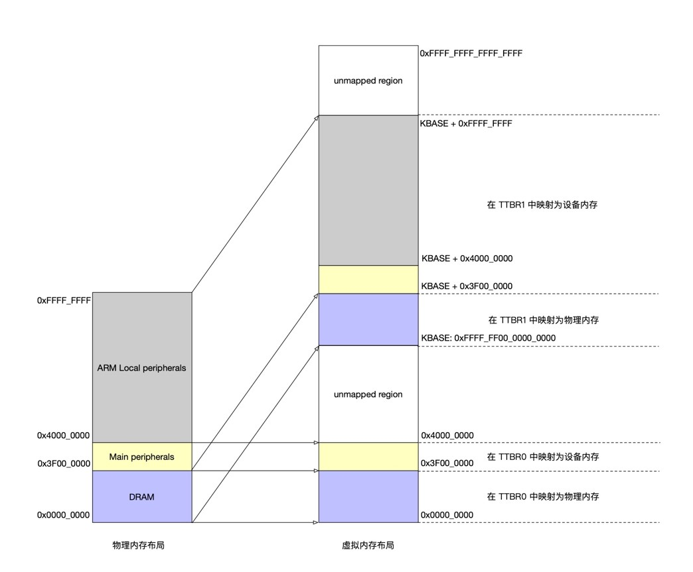

## OS-Lab2: 内存管理

学号：520021910605   姓名：罗世才


#### 思考题 1：请思考多级页表相比单级页表带来的优势和劣势（如果有的话），并计算在 AArch64 页表中分别以 4KB 粒度和 2MB 粒度映射 0～4GB 地址范围所需的物理内存大小（或页表页数量）。

**优势：**

1. 多级页表允许在整个页表结构中出现空洞，在虚拟地址没有全部映射到物理内存时节约页表占用的内存；
2. 使用多级页表可以使得页表在内存中离散存储，不占用太长的连续物理内存。    

**劣势：**

1. 在应用程序使用虚拟地址较多的情况下，多级页表比单级页表占用了更多的内存空间；
2. 多级页表的设计更加复杂，增加了内存管理的复杂性；
3. 在TLB miss情况下，多级页表查表得访存次数更多，查表效率降低。            

**计算：**

1. 在AArch64页表中以4KB粒度映射：

   - 一个L3级页表可以映射内存大小为：4KB/8*4KB=2MB

   ​       4GB一共需要4GB/2MB=2KB个L3级页表

   - 一个L2级页表可以存4KB/8=0.5KB个L3级页表

   ​       共需要2/0.5=4个L2级页表

   - 共需要1个L0,1个L1级页表

   综上所述，映射0~4GB地址范围所需的页表页数量为2054个，需要物理内存为2054*4KB约为8MB的物理内存。

   2. 在AArch64页表中以2MB粒度映射：

      - 虚拟地址的低21位表示页内偏移，一个页表可以存2MB/8=256KB个PTE，所以每一级页表需要在虚拟地址中用18位标识，所以64位最多用2级页表。

      - 一个L1级页表可以映射的内存大小为：2MB/8*2MB=512GB，所以只需要一个L1级页表，一个L0级页表。

      综上所述，映射0~4GB地址范围所需的页表页数量为2个，需要物理内存为2MB*2=4MB。

      

#### 练习题 2：请在 `init_boot_pt` 函数的 `LAB 2 TODO 1` 处配置内核高地址页表（`boot_ttbr1_l0`、`boot_ttbr1_l1` 和 `boot_ttbr1_l2`），以 2MB 粒度映射。

  填写代码如下所示：

```
        /* TTBR1_EL1 0-1G */
        /* LAB 2 TODO 1 BEGIN */
        /* Step 1: set L0 and L1 page table entry */
        u64 paddr = PHYSMEM_START;
        boot_ttbr1_l0[GET_L0_INDEX(paddr + KERNEL_VADDR)] = 
            ((u64)boot_ttbr1_l1) | IS_TABLE | IS_VALID | NG;
        boot_ttbr1_l1[GET_L1_INDEX(paddr + KERNEL_VADDR)] =
            ((u64)boot_ttbr1_l2) | IS_TABLE | IS_VALID | NG; 

        /* Step 2: map PHYSMEM_START ~ PERIPHERAL_BASE with 2MB granularity */
        for (;paddr < PERIPHERAL_BASE; paddr+=SIZE_2M) {
                boot_ttbr1_l2[GET_L2_INDEX(paddr + KERNEL_VADDR)] = 
                        (paddr) /* high mem, va = pa + KERNEL_VADDR */  
                        | UXN /* Unprivileged execute never */
                        | ACCESSED /* Set access flag */
                        | NG /* Mark as not global */
                        | INNER_SHARABLE /* Sharebility */
                        | NORMAL_MEMORY /* Normal memory */
                        | IS_VALID;
        }

        /* Step 3: map PERIPHERAL_BASE ~ PHYSMEM_END with 2MB granularity */
        for (paddr = PERIPHERAL_BASE; paddr < PHYSMEM_END; paddr+=SIZE_2M) {
                boot_ttbr1_l2[GET_L2_INDEX(paddr + KERNEL_VADDR)] = 
                        (paddr) /* high mem, va = pa + KERNEL_VADDR */  
                        | UXN /* Unprivileged execute never */
                        | ACCESSED /* Set access flag */
                        | NG /* Mark as not global */
                        | DEVICE_MEMORY /* Device memory */
                        | IS_VALID;                
        }
        /* LAB 2 TODO 1 END */
```

  这里填写的内核高地址页表和框架里已经给出的用户低地址页表映射的是同一段物理内存。

  在设置boot_ttbr1_l0指向boot_ttbr1_l1，boot_ttbr1_l1指向boot_ttbr1_l2之后，用循环映射l2。与TTBR0的设置相比，只有虚拟地址的范围不同（即va = pa + KERNEL_VADDR），其它没有区别。




#### 思考题 3：请思考在 `init_boot_pt` 函数中为什么还要为低地址配置页表，并尝试验证自己的解释。

​    在配置页表，打开MMU之前，CPU一直使用的是物理地址，即PC指针指向的是初始化代码的物理地址（低地址）。如果没有配置低地址页表，打开MMU后，操作系统会认为PC的地址是虚拟地址，但低地址区域又没有建立对应的映射，没法翻译，从而出错。所以就像上图所显示的内存布局一样，不仅为低地址配置页表，而且虚拟地址与物理地址一致，使得PC所指向的地址最终仍会映射到相同的物理地址上，这样在开启MMU前后程序均能正常运行。

​    **验证：** 将init_boot_pt函数中为低地址配置页表的的代码给注释掉，运行GDB进行调试，结果如下所示：


​    程序在输出[BOOT]Install boot page table之后卡住，运行GDB发现报"Cannot access memory at address 0x200"说明MMU无法翻译低地址。


#### 思考题 4：请解释 `ttbr0_el1` 与 `ttbr1_el1` 是具体如何被配置的，给出代码位置，并思考页表基地址配置后为何需要ISB指令。

  在kernel/arch/aarch64/boot/raspi3/init/tools.S中，有这样一段代码来配置用户态页表基地址寄存器ttbr0_el1和内核态页表基地址寄存器ttbr1_el1：


 其中,boot_ttbr0_l0和boot_ttbr1_l0是之前在`init_boot_pt` 函数中配置的高地址和低地址l0级页表的地址。代码的具体意义如下：

1. 使用 ADRP 指令加载 boot_ttbr0_l0 和 boot_ttbr1_l0 符号的地址到寄存器 x8 中。
2. 使用 MSR 指令将 x8 寄存器中的值写入到 ttbr0_el1 和 ttbr1_el1 寄存器中，分别设置内核态和用户态的页表基地址。
3. 使用 ISB 指令刷新指令流水线，确保新的页表基地址可以立即生效。

  使用ISB指令是因为在配置页表基地址时，需要保证页表是完全建立好的，不然处理器可能会出现不可预期的行为。而为了确保新的页表生效，需要使用指令栅栏（instruction barrier）来强制处理器在执行后面的指令之前刷新指令流水线中的所有指令。在 ARM 架构中，这个指令栅栏是 ISB (Instruction Synchronization Barrier) 指令。所以在配置页表基地址后需要加上 ISB 指令，以确保新的页表能够立即生效。


#### 练习题 5：完成 `kernel/mm/buddy.c` 中的 `split_page`、`buddy_get_pages`、`merge_page` 和 `buddy_free_pages` 函数中的 `LAB 2 TODO 2` 部分，其中 `buddy_get_pages` 用于分配指定阶大小的连续物理页，`buddy_free_pages` 用于释放已分配的连续物理页。

  在数据结构组织方面，我感觉有点不同的是每个page有一个node成员变量，phys_mem_pool中的空闲链表只把这个node链起来，在寻找时，先找到node，再通过list_entry这个特殊的宏找到对应的page。

  熟悉数据结构和提示中的功能函数后，就可以实现伙伴系统了：

**1.split_page的实现：** 我没有使用递归函数来实现，因为我觉得使用循环实现更简单直观。实现思路为，如果page->order>order，则page->order--，通过get_buddy_chunk找到分裂的另一半，将其插入对应的空闲链表中。重复上述步骤直到page->order==order。具体代码如下所示：

```
static struct page *split_page(struct phys_mem_pool *pool, u64 order,
                               struct page *page)
{
        /* LAB 2 TODO 2 BEGIN */
        /*
         * Hint: Recursively put the buddy of current chunk into
         * a suitable free list.
         */
        while (page->order > order) {
                // The newly generated second half of the split page
                struct page *new_page;   

                // split
                --page->order;

                new_page = get_buddy_chunk(pool, page);
                new_page->allocated=0;
                new_page->order=page->order;
                list_add(&(new_page->node), &(pool->free_lists[new_page->order].free_list));
                pool->free_lists[new_page->order].nr_free++;
        }
        
        return page;
        /* LAB 2 TODO 2 END */
}
```

**2.buddy_get_pages的实现：** 从order级别开始，从小到大遍历当前pool的freelists，找到大于等于需要分配的页的order的最小块，然后split_page拿到刚好为order大小的块返回。具体代码为：

```
struct page *buddy_get_pages(struct phys_mem_pool *pool, u64 order)
{
        /* LAB 2 TODO 2 BEGIN */
        /*
         * Hint: Find a chunk that satisfies the order requirement
         * in the free lists, then split it if necessary.
         */
        struct page *pg = NULL;
        for (u64 od=order; od<BUDDY_MAX_ORDER; ++od) {
                if (pool->free_lists[od].nr_free>0) {
                        pg = list_entry(pool->free_lists[od].free_list.next, struct page, node);
                        // Maintain idle linked list
                        list_del(&(pg->node));
                        pool->free_lists[od].nr_free--;
                        // for safe
                        init_list_head(&pg->node);

                        pg = split_page(pool, order, pg);
                        pg->allocated=1;
                        break;
                }
        }
        return pg;
        /* LAB 2 TODO 2 END */
}
```

**3.merge_page的实现：** 同样采用一个循环来实现。实现思路为：在当前页的order不是最大的order的情况下，通过get_buddy_chunk函数找到他的伙伴块，如果他的伙伴块是空闲的，则将伙伴块从空闲链表中删除，与其合并成一个更大的块，块的地址为两个小块中小的那个。重复上述步骤直到伙伴块非空闲或合并成伙伴系统中最大的一整个块。具体代码为：

```
static struct page *merge_page(struct phys_mem_pool *pool, struct page *page)
{
        /* LAB 2 TODO 2 BEGIN */
        /*
         * Hint: Recursively merge current chunk with its buddy
         * if possible.
         */
        struct page *buddy_page = NULL;
        while (page->order < BUDDY_MAX_ORDER - 1) {
                buddy_page = get_buddy_chunk(pool, page);
                if (buddy_page==NULL || page->order!=buddy_page->order || buddy_page->allocated==1) {
                        break;
                }
                // delete buddy page from idle list
                list_del(&buddy_page->node);
                pool->free_lists[buddy_page->order].nr_free--;
                init_list_head(&buddy_page->node);
                // The smaller one is the representative
                page = (page < buddy_page) ? page : buddy_page;
                page->order++;
        }
        
        return page;
        /* LAB 2 TODO 2 END */
}
```

**4.budy_free_pages的实现：** 调用一次merge_page，将不能再合并的块插入对应的空闲链表中。具体实现代码为：

```
void buddy_free_pages(struct phys_mem_pool *pool, struct page *page)
{
        /* LAB 2 TODO 2 BEGIN */
        /*
         * Hint: Merge the chunk with its buddy and put it into
         * a suitable free list.
         */
        page = merge_page(pool, page);

        page->allocated=0;
        list_add(&(page->node), &(pool->free_lists[page->order].free_list));
        pool->free_lists[page->order].nr_free++;
        /* LAB 2 TODO 2 END */
}

```


#### 练习题 6：完成 `kernel/arch/aarch64/mm/page_table.c` 中的 `get_next_ptp`、 `query_in_pgtbl`、`map_range_in_pgtbl`、`unmap_range_in_pgtbl` 函数中的 `LAB 2 TODO 3` 部分，后三个函数分别实现页表查询、映射、取消映射操作，其中映射和取消映射以 4KB 页为粒度。

  在数据结构方面要注意的是pte_t是一个64位的union，有table（L0,L1,L2页表项，主要存储了下一级页表的物理地址）、L1_block（L1页表项，指向1G大页）、L2_block（L2页表项，指向2MB大页）、L3_page（L3级页表项，指向4K的数据页)。多出来的那个u64 pte应该是为了方便初始化等整体操作。

  **1.get_next_ptp的实现：** 这一段待填写代码发生于在查找下一级页表时出现该页表尚未分配的情况。基本思路为申请一块新的物理页作为该页表，然后填写新分配页表所属上一级页表的对应页表项信息。

```
new_ptp = get_pages(0);   // alloc 4K(order=0)
BUG_ON(new_ptp == NULL);
memset((void *)new_ptp, 0, PAGE_SIZE);
new_ptp_paddr = virt_to_phys((vaddr_t)new_ptp);

new_pte_val.pte = 0;
new_pte_val.table.is_valid = 1;
new_pte_val.table.is_table = 1;
new_pte_val.table.next_table_addr = new_ptp_paddr >> PAGE_SHIFT;
                
cur_ptp->ent[index] = new_pte_val;
```

  **2.query_in_pgtbl的实现：** 函数的功能是查找在pgtbl页表的映射下，虚拟地址va对应的物理地址pa，并将pa和对应的pte entry返回。基本思路为：通过get_next_ptp函数不断查找下一级页表，如果该函数返回BLOCK_PTP且level为1或2表明是大页映射，四次循环后函数尚未返回表明是常规4K数据页，以上两种情况按照页大小组成对应的物理地址后返回。如果该函数返回-ENOMAPPING表明该地址尚未映射，这里的策略是将-ENOMAPPING信息继续往上传递。

```
int query_in_pgtbl(void *pgtbl, vaddr_t va, paddr_t *pa, pte_t **entry)
{
  /* LAB 2 TODO 3 BEGIN */
  /*
  * Hint: Walk through each level of page table using `get_next_ptp`,
  * return the pa and pte until a L0/L1 block or page, return
  * `-ENOMAPPING` if the va is not mapped.
  */
  ptp_t *cur_ptp = (ptp_t *)pgtbl;
  pte_t *pte;

  for (int level=0; level<=3; level++) {
      int res = get_next_ptp(cur_ptp, level, va, &cur_ptp, &pte, false);
                
      if (res == -ENOMAPPING) {
         return res;
      }
      else if (res == BLOCK_PTP) {
         if (level == 1) {
            *entry = pte;
            *pa = virt_to_phys(cur_ptp) + GET_VA_OFFSET_L1(va);   // 1G Huge Page
            return 0;
         }
         else if (level == 2) {
            *entry = pte;
            *pa = virt_to_phys(cur_ptp) + GET_VA_OFFSET_L2(va);   // 2M Huge Page;
            return 0;
         }
      }
  }
  // normal 4K page
  // point to an pte in L3 page table
  *entry = pte;   
  // next_ptp point to the pte point page table(4K data page)
  *pa = virt_to_phys(cur_ptp) + GET_VA_OFFSET_L3(va);  
        
  return 0;
  /* LAB 2 TODO 3 END */
}
```

  **3.map_range_in_pgtbl的实现:** 此函数的功能是建立从虚拟地址va到物理地址pa长度为len的映射。实现的基本思路为：使用get_next_ptp(alloc=true)逐级查找/创建下级页表，在获得L3级页表后，在对应的页表项中填写物理地址信息建立映射，重复操作直到达到len长度为止。

```
int map_range_in_pgtbl(void *pgtbl, vaddr_t va, paddr_t pa, size_t len,
                       vmr_prop_t flags) {
  /* LAB 2 TODO 3 BEGIN */
  /*
  * Hint: Walk through each level of page table using `get_next_ptp`,
  * create new page table page if necessary, fill in the final level
  * pte with the help of `set_pte_flags`. Iterate until all pages are
  * mapped.
  */
  u64 page_num = len / PAGE_SIZE + (len % PAGE_SIZE > 0);

  while (page_num > 0) {
     ptp_t *current_ptp = (ptp_t *)pgtbl;
     pte_t *pte;
     for (int i = 0; i < 3; ++i) {
         get_next_ptp(current_ptp, i, va, &current_ptp, &pte, true);
     }
                
     // l3
     for (int i = GET_L3_INDEX(va); i < PTP_ENTRIES; ++i) {
         pte_t new_pte_val;

         new_pte_val.pte = 0;
         new_pte_val.l3_page.is_valid = 1;
         new_pte_val.l3_page.is_page = 1;
         new_pte_val.l3_page.pfn = pa >> PAGE_SHIFT;
         set_pte_flags(&new_pte_val, flags, USER_PTE);

         current_ptp->ent[i].pte = new_pte_val.pte;

         va += PAGE_SIZE;
         pa += PAGE_SIZE;

         --page_num;
         if (page_num == 0) {
            break;
         }
     }
  }

  return 0;
  /* LAB 2 TODO 3 END */
}
```

**4.unmap_range_in_pgtbl的实现：** 此函数的功能是消除虚拟地址va对应的长度为len的映射。实现的基本思路与map相似，通过get_next_ptp(alloc=false)不断查找下一级页表，找到L3页表后将对应的页表项置0，重复上述操作直到长度为len。

  在实现时我对一些细节很犹豫。比如，如果get_next_ptp返回-ENOMAPPING，怎么处理比较好，最后我感觉这种调用应该是错误的，如果将这个page table当作已经unmap了继续处理感觉也不合适，仔细阅读文档发现它说映射和取消映射是以4K为粒度，那这种情况就更不应该出现，我只是简单的返回-ENOMAPPING将错误信息上传，这样从结果上看那4k页确实unmap了上层也可以获得错误信息。

```
int unmap_range_in_pgtbl(void *pgtbl, vaddr_t va, size_t len) {
  /* LAB 2 TODO 3 BEGIN */
  /*
  * Hint: Walk through each level of page table using `get_next_ptp`,
  * mark the final level pte as invalid. Iterate until all pages are
  * unmapped.
  */
  u64 page_num = (len-1) / PAGE_SIZE + 1;
  ptp_t *cur_ptp = (ptp_t *)pgtbl;
  pte_t *pte;

  while (page_num > 0) {
      cur_ptp = (ptp_t *)pgtbl;
      for (int level=0; level<3; ++level) {
         int res = get_next_ptp(cur_ptp, level, va, &cur_ptp, &pte, false);
         if (res == -ENOMAPPING) {
             return res;
         }
      }

      // L3
      for (int i = GET_L3_INDEX(va); i < PTP_ENTRIES; ++i) {
            cur_ptp->ent[i].pte = PTE_DESCRIPTOR_INVALID;

            va += PAGE_SIZE;

            --page_num;
            if (page_num==0){
               break;
            }
      }
  }

  return 0;
  /* LAB 2 TODO 3 END */
}
```


#### 练习题 7：完成 `kernel/arch/aarch64/mm/page_table.c` 中的 `map_range_in_pgtbl_huge` 和 `unmap_range_in_pgtbl_huge` 函数中的 `LAB 2 TODO 4` 部分，实现大页（2MB、1GB 页）支持。

 **1. map_range_in_pgtbl_huge的实现：** 此函数的功能是建立从虚拟地址va到物理地址pa长度为len的映射，但在len的长度可以分配大页时，优先分配大页。实现的基本思路就是：如果len大于1G，则不断使用1G的大页建立映射直到len小于1G；如果len小于1G但大于2MB，则不断使用2MB的大页建立映射直到len小于2MB；如果len小于2MB则不断使用4KB的页建立映射直到完整映射了len长度。每次映射后应调整va，pa和len的大小。

```
int map_range_in_pgtbl_huge(void *pgtbl, vaddr_t va, paddr_t pa, size_t len,
                            vmr_prop_t flags)
{
    /* LAB 2 TODO 4 BEGIN */
    u64 page_1G = 1 << 30;
    u64 page_2M = 1 << 21;
    pte_t *pte;

    // if len > 1G, then map 1G huge page
    u64 page_num = len / page_1G;
    len = len - page_num * page_1G;
    while (page_num > 0) {
            ptp_t *cur_ptp = (ptp_t*)pgtbl;
            get_next_ptp(cur_ptp, 0, va, &cur_ptp, &pte, true);
            for (int i = GET_L1_INDEX(va); i < PTP_ENTRIES; ++i) {
                 // set L1 page's page entry
                 pte = &(cur_ptp->ent[i]);
                 pte->pte = 0;
                 pte->l1_block.is_valid = 1;
                 pte->l1_block.is_table = 0;
                 pte->l1_block.pfn = pa >> 30;
                 set_pte_flags(pte, flags, USER_PTE);

                 va += page_1G;
                 pa += page_1G;
                 page_num--;
                 if (page_num==0) {
                     break;
                 }
            }
        
    }

    // if len > 2M, then map 2M huge page
    page_num = len / page_2M;
    len = len - page_num * page_2M;
    while (page_num > 0) {
          ptp_t *cur_ptp = (ptp_t*)pgtbl;
          get_next_ptp(cur_ptp, 0, va, &cur_ptp, &pte, true);
          get_next_ptp(cur_ptp, 1, va, &cur_ptp, &pte, true);

          for (int i = GET_L2_INDEX(va); i < PTP_ENTRIES; ++i) {
              // set L2 page's page entry
              pte = &(cur_ptp->ent[i]);
              pte->pte = 0;
              pte->l2_block.is_valid = 1;
              pte->l2_block.is_table = 0;
              pte->l2_block.pfn = pa >> 21;
              set_pte_flags(pte, flags, USER_PTE);

              va += page_2M;
              pa += page_2M;
              page_num--;
              if (page_num==0) {
                  break;
              }
          }
    }
        
    // normal page
    page_num = (len-1)/PAGE_SIZE + 1;
    while (page_num > 0) {
          ptp_t *cur_ptp = (ptp_t*)pgtbl;
          get_next_ptp(cur_ptp, 0, va, &cur_ptp, &pte, true);
          get_next_ptp(cur_ptp, 1, va, &cur_ptp, &pte, true);
          get_next_ptp(cur_ptp, 2, va, &cur_ptp, &pte, true);

          for (int i = GET_L3_INDEX(va); i < PTP_ENTRIES; ++i) {
              // set L3 page's page entry
              pte = &(cur_ptp->ent[i]);
              pte->pte = 0;
              pte->l3_page.is_valid = 1;
              pte->l3_page.is_page = 0;
              pte->l3_page.pfn = pa >> 12;
              set_pte_flags(pte, flags, USER_PTE);

              va+=PAGE_SIZE;
              pa+=PAGE_SIZE;
              page_num--;
              if (page_num == 0) {
                  break;
              }
         }
    }
        
    return 0;
        /* LAB 2 TODO 4 END */
}
```

**2. unmap_range_in_pgtbl_huge的实现：** 此函数的功能是消除虚拟地址va对应的长度为len的映射。实现的基本思路与unmap_huge相似，用get_next_ptp一级一级向下查找，在L1和L2级时，如果发现返回的是数据页(BLOCK_PTP)则消除大页映射，最后将普通映射的部分也unmap。为了后续unmap的正确进行，每次取消映射后应在调整va和len的大小后再继续循环。

```
int unmap_range_in_pgtbl_huge(void *pgtbl, vaddr_t va, size_t len)
{
    /* LAB 2 TODO 4 BEGIN */
    u64 page_1G = 1 << 30;
    u64 page_2M = 1 << 21;        
    pte_t *pte;
        
    while (len > 0) {
          ptp_t *cur_ptp = (ptp_t*)pgtbl;
          // l0->l1
          int res = get_next_ptp(cur_ptp, 0, va, &cur_ptp, &pte, false);
          if (res == -ENOMAPPING) {
              return res;
          }

          // l1->l2 / l1->1G huge page
          res = get_next_ptp(cur_ptp, 1, va, &cur_ptp, &pte, false);
          if (res == -ENOMAPPING) {
              return res;
          }
          else if (res == BLOCK_PTP) {
              pte->pte = 0;
              va += page_1G;
              len -= page_1G;
              continue;
          }

          // l2->l3 / l2->2M huge page 
          res = get_next_ptp(cur_ptp, 2, va, &cur_ptp, &pte, false);
          if (res == -ENOMAPPING) {
              return res;
          } 
          else if (res == BLOCK_PTP) {
              pte->pte=0;
              va += page_2M;
              len -= page_2M;
              continue;
          }

          // l3 ptp
          for (int i=GET_L3_INDEX(va); i<PTP_ENTRIES; ++i) {
              cur_ptp->ent[i].pte=0;
              va+=PAGE_SIZE;
              len-=PAGE_SIZE;

              if (len <= 0) {
                 break;
              }
          }       
    }

    return 0;
    /* LAB 2 TODO 4 END */
}
```

#### 思考题 8：阅读 Arm Architecture Reference Manual，思考要在操作系统中支持写时拷贝（Copy-on-Write，CoW）[^cow]需要配置页表描述符的哪个/哪些字段，并在发生缺页异常（实际上是 permission fault）时如何处理

  为了在操作系统中支持写时拷贝，需要设置AP[7:6]位为只读。

  具体来说，写时拷贝允许不同的应用程序以只读的方式共享同一段物理内存，一旦某个应用程序想要写这一个设置了写保护位的页面时，就会触发缺页异常。操作系统会将该共享内存复制到新的物理页中，并将新拷贝的物理页以可读可写的方式重新映射给触发异常的应用程序，这样该应用程序就可以写入了。


#### 思考题 9：为了简单起见，在 ChCore 实验中没有为内核页表使用细粒度的映射，而是直接沿用了启动时的粗粒度页表，请思考这样做有什么问题。

1. 粗粒度页表难以对权限做细粒度管理，可能造成一些安全问题。例如，将.data段（可读可写）和.text段（可读可执行，但不可写）都映射在具有相同读写权限粗粒度页表内，可能导致.text的代码也可以被修改，造成安全隐患。

2. 粗粒度的页表可能导致因未使用整个大页而产生许多内部碎片，从而造成物理内存资源的浪费；

   

#### 挑战题 10：使用前面实现的 `page_table.c` 中的函数，在内核启动后重新配置内核页表，进行细粒度的映射。

  和助教交流后，我明白了这道题的目的是为让我们根据内核虚拟地址空间不同的段，做不同的权限管理，以避免思考题9中列举的那些可能出现的问题。

  我写了一段伪代码，来表明我的实现思路：

```
// 获取linker script提供的符号
extern u64 _text_start;
extern u64 _text_end;
extern u64 _data_start;
extern u64 _data_end;

// L0级页表项
void *pgtbl = get_pages(0);
memset(pgtbl, 0, PAGE_SIZE);

// 根据段的权限，配置flag，并使用map_range_in_pgtbl进行映射
// .text段 可读可执行 直接映射va=pa+KBASE
u64 len = _text_end - _text_start;
vmr_prop_t flags = VMR_READ | VMR_EXEC;
map_range_in_pgtbl(pgtbl, KBASE+_text_start, _text_start, len, flags);

// .data段 可读可写 直接映射va=pa+KBASE
len = _data_end - _data_start;
flags = VMR_READ | VMR_WRITE;
map_range_in_pgtbl(pgtbl, KBASE+_data_start, _data_start, len, flags);

// .bss(可读写) .rodata(只读) .stack(可读写) .heap(可读写) 与上面相似
// 因为map_range_in_pgtbl内部就是4K进行映射，所以不需要一个个PAGE_SIZE去调用循环
```


最后make grade：


