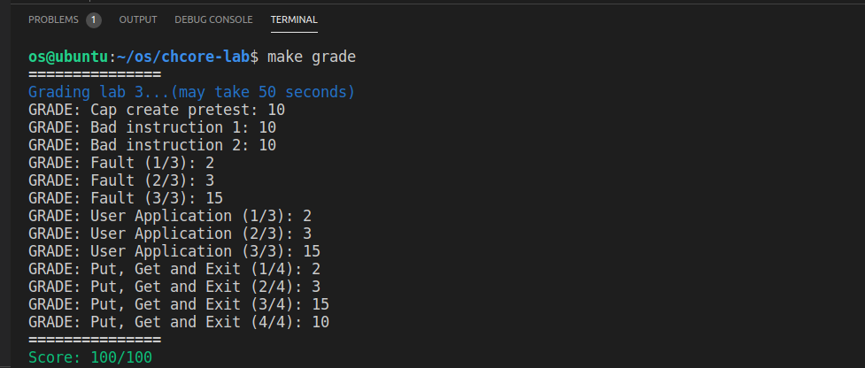

## OS-Lab3: 进程与线程创建、异常处理

学号：520021910605  姓名：罗世才


#### 思考题 1: 内核从完成必要的初始化到用户态程序的过程是怎么样的？尝试描述一下调用关系。

以ChCore为例过程如下：

  一. 内核启动

1. 启动CPU0号核：_start函数是ChCore内核启动的第一块代码。ChCore中，会让0号核进入初始化流程，而其它核在支持SMP之前都被hang住；
2. 切换异常级别：通过调用arm64_elX_to_el1切换异常级别为EL1;
3. 跳转执行第一块C代码：init_c是第一块C代码，在这个函数中：

   a.调用clear_bss来清除kernel image的.bss段；
 
   b.调用early_uart_init初始化uart;

   c.调用init_boot_pt配置内核启动页表；

   d.调用el1_mmu_activate启用MMU;

   e.调用start_kernel跳转到高地址，进而跳转到内核的main函数；

  二. 从内核进入用户态程序
  
     在main函数中：
 
 1. 调用uart_init来初始化uart；
 
 2. 调用mm_init初始化内存管理模块；
 
 3. 调用arch_interrupt_init来初始化异常向量表；
 
 4. 调用create_root_thread来创建root_thread,即第一个用户线程；
 
 5. 调用switch_context将vmspace切换为该用户态线程的vmspace；
 
 6. 调用eret_to_thread将控制权转交到该线程。

通过上面的步骤，完成了内核从完成必要的初始化到用户态程序的过程。


#### 练习题 2: 在 `kernel/object/cap_group.c` 中完善 `cap_group_init`、`sys_create_cap_group`、`create_root_cap_group` 函数。在完成填写之后，你可以通过 Cap create pretest 测试点。注意通过这里的测试并不代表完全实现正确，后续在实验 4 中会再次测试这一部分。

**1.cap_group_init的实现：** 该函数的功能为初始化新的cap_group对象并设置必要的参数。实现思路为初始化struct cap_group的几个成员变量。

```
int cap_group_init(struct cap_group *cap_group, unsigned int size, u64 pid)
{
        struct slot_table *slot_table = &cap_group->slot_table;
        /* LAB 3 TODO BEGIN */
        slot_table_init(slot_table, size);
        cap_group->pid = pid;
        cap_group->thread_cnt = 0;
        init_list_head(&(cap_group->thread_list));
        /* LAB 3 TODO END */
        return 0;
}
```

   **2. sys_create_cap_group与create_root_cap_group的实现：** 

   比较难以理解的是cap_alloc这个操作。在ChCore中，所有的内核资源均被抽象成了内核对象，cap_group作为进程的抽象，有一个slot_table的成员，表示该进程有权访问的内核对象的数组，内核对象在该数组中的索引即为该对象的cap。

   cap_alloc(struct cap_group *cap_group, void *obj, u64 rights)的功能为：给cap_group分配一个空闲槽位，并将该槽位与obj建立联系，这样cap_group就可以合法的访问obj了。(似乎cap和slot_id是一个意思)。

   需要注意的是，进程本身也是这样一个内核对象。所以在sys_create_cap_group函数中，有这样一段代码，表示让父进程可以合法的访问子进程：

```
cap = cap_alloc(current_cap_group, new_cap_group, 0);
```

   而create_root_cap_group中，因为是创建的root_cap_group，它没有父进程，为了让cap_group可以访问自身，所以使用下面的代码：

```
slot_id = cap_alloc(cap_group, cap_group, 0);
```

   感觉理解了这个之后代码就好写一些了。 两个函数其它的逻辑，功能类似，sys_create_cap_group是一个系统调用，功能是创建一个全新的cap_group。create_root_cap_group是创建一个根cap_group。

  具体思路为：使用obj_alloc分配全新的cap_group和vmspace对象，对分配得到的cap_group对象，通过cap_group_init初始化，并按照上面的分析合理的调用cap_alloc以便其可被访问到；对分配得到的vmspce对象，通过cap_alloc设置对应的slot。详情见提交代码。

  

#### 练习题 3: 在 `kernel/object/thread.c` 中完成 `load_binary` 函数，将用户程序 ELF 加载到刚刚创建的进程地址空间中。

   正如题目中所说，load_binary函数的功能是将用户程序ELF加载到刚刚创建的进程地址空间中。函数逻辑不算复杂，难点在于理解数据结构和功能函数，具体实现为：

   在给出的代码中，使用了elf_parse_file()函数解析ELF文件，得到了elf_file结构体；使用kmalloc分配pmo_cap数组，用于存储每个段对应的PMO的cap。

   然后遍历ELF文件中的每个段，对于每个PT_LOAD类型的段，进行一下操作：

  1. 计算对齐后的段大小seg_map_sz；
  2. 调用create_pmo()，该函数创建一个新的内存对象(PMO)，并将其与cap_group绑定使其可以被访问，最后返回cap以及通过二级指针返回PMO。段的数据就保存在这个PMO中，所以段大小seg_map_sz作为参数传入并使用PMO_DATA表明该PMO是存数据的；
  3. 随后就是ELF加载操作，为此，首先使用memset初始化空间为0，然后使用memcpy将ELF文件中当前段的内容复制到PMO虚拟地址空间里;
  4. 调用PFLAGS2VMRFLAGS()，根据段的属性设置VMR的flag；
  5. 调用vmspace_map_range()将PMO映射到进程的虚拟地址空间中。

  实现代码如下所示：

```
/* load each segment in the elf binary */
for (i = 0; i < elf->header.e_phnum; ++i) {
    pmo_cap[i] = -1;
    if (elf->p_headers[i].p_type == PT_LOAD) {
        seg_sz = elf->p_headers[i].p_memsz;
        p_vaddr = elf->p_headers[i].p_vaddr;
        /* LAB 3 TODO BEGIN */
                        
        seg_map_sz = ROUND_UP((p_vaddr + seg_sz), PAGE_SIZE) - ROUND_DOWN(p_vaddr, PAGE_SIZE);
        pmo_cap[i] = create_pmo(seg_map_sz, PMO_DATA, cap_group, &pmo);
        memset((void *)phys_to_virt(pmo->start), 0, pmo->size);
        memcpy((void *)phys_to_virt(pmo->start)+(OFFSET_MASK & p_vaddr), bin+elf->p_headers[i].p_offset, elf->p_headers[i].p_filesz);

        flags = PFLAGS2VMRFLAGS(elf->p_headers[i].p_flags);
        ret = vmspace_map_range(vmspace, ROUND_DOWN(p_vaddr, PAGE_SIZE), seg_map_sz, flags, pmo);
                        
        /* LAB 3 TODO END */
        BUG_ON(ret != 0);
    }
}
```

  

#### 练习题 4: 按照前文所述的表格填写 `kernel/arch/aarch64/irq/irq_entry.S` 中的异常向量表，并且增加对应的函数跳转操作。

  按照`kernel/arch/aarch64/irq/irq_entry.h`中的define填充异常向量表，对于异常处理就按照Guide上写的，将sync_el1h类型的异常跳转到 `handle_entry_c` ，对于irq_el1t、fiq_el1t、fiq_el1h、error_el1t、error_el1h、sync_el1t 则跳转 到`unexpected_handler` 。


#### 练习题 5: 填写 `kernel/arch/aarch64/irq/pgfault.c` 中的 `do_page_fault`，需要将缺页异常转发给 `handle_trans_fault` 函数。

  按照Guide上的提示直接转发即可：

```
  /* LAB 3 TODO BEGIN */
  ret = handle_trans_fault(current_thread->vmspace, fault_addr);
  /* LAB 3 TODO END */
```


#### 练习题 6: 填写 `kernel/mm/pgfault_handler.c` 中的 `handle_trans_fault`，实现 `PMO_SHM` 和 `PMO_ANONYM` 的按需物理页分配。

  对于物理页未分配的情况，需要分配一个新的物理页，将页记录到PMO中并增加页表映射：

```
  /* Not committed before. Then, allocate the physical
  * page. */
  /* LAB 3 TODO BEGIN */
  void *page = get_pages(0);
  pa = virt_to_phys(page);
  memset((void *)phys_to_virt(pa), 0, PAGE_SIZE);
  commit_page_to_pmo(pmo, index, pa);
  map_range_in_pgtbl(vmspace->pgtbl, fault_addr, pa, PAGE_SIZE, perm);
  /* LAB 3 TODO END */
```

  对于物理页已分配的情况，只需要修改页表映射即可：

```
map_range_in_pgtbl(vmspace->pgtbl, fault_addr, pa, PAGE_SIZE, perm);
```


#### 练习题 7: 按照前文所述的表格填写 `kernel/arch/aarch64/irq/irq_entry.S` 中的 `exception_enter` 与 `exception_exit`，实现上下文保存的功能

  这两个函数主要是完成处理器上下文保存和恢复的功能。因为处理器上下文位于内核栈底部，所以对其的保存只需要将需要保存的寄存器值依次压入栈中即可，对其的恢复就是将之前保存在内核栈中的值依次恢复到寄存器中，再通过add指令将内核栈变空即可。

  处理器上下文包括通用寄存器x0~x30，特殊寄存器sp_el0，系统寄存器elr_el1、spsr_el1。


#### 思考题 8： ChCore中的系统调用是通过使用汇编代码直接跳转到`syscall_table`中的 相应条目来处理的。请阅读`kernel/arch/aarch64/irq/irq_entry.S`中的代码，并简要描述ChCore是如何将系统调用从异常向量分派到系统调用表中对应条目的。

  在irq_entry.S中，具体汇编代码如下所示：


  具体来说，在ChCore中，当用户程序执行系统调用('svc'指令)时，会引发一个'sync_el0_64'的异常，进而将控制权转移到irq_entry.S中与上面图片中的代码所匹配。'sync_el0_64'对应的异常处理中，首先会检查是不是所支持的系统调用类型，如果是则跳转到'el0_syscall'处，通过'syscall_table'数组和系统调用参数查找到对应系统调用函数的地址，然后跳转过去，从而完成从异常向量分派到系统调用表中对应条目的过程。


#### 练习题 9: 填写 `kernel/syscall/syscall.c` 中的 `sys_putc`、`sys_getc`，`kernel/object/thread.c` 中的 `sys_thread_exit`，`libchcore/include/chcore/internal/raw_syscall.h` 中的 `__chcore_sys_putc`、`__chcore_sys_getc`、`__chcore_sys_thread_exit`，以实现 `putc`、`getc`、`thread_exit` 三个系统调用。

1.`sys_putc`和`sys_getc`直接调用对应的uart函数即可：

```
void sys_putc(char ch)
{
        /* LAB 3 TODO BEGIN */
        uart_send(ch);
        /* LAB 3 TODO END */
}

u32 sys_getc(void)
{
        /* LAB 3 TODO BEGIN */
        return uart_recv();
        /* LAB 3 TODO END */
}
```

2.`sys_thread_exit`将本线程的`state`设为`TS_EXIT`并将`current_thread`设为NULL使系统不会再调度到该线程：

```
/* Exit the current running thread */
void sys_thread_exit(void)
{
#ifdef CHCORE_LAB3_TEST
        printk("\nBack to kernel.\n");
#endif
        /* LAB 3 TODO BEGIN */
        current_thread->thread_ctx->state = TS_EXIT;
        current_thread = NULL;
        /* LAB 3 TODO END */
        printk("Lab 3 hang.\n");
        while (1) {
        }
        /* Reschedule */
        sched();
        eret_to_thread(switch_context());
}
```

3. 在同一目录下的syscall_num.h文件定义了系统调用对应的number，根据系统调用的类型和参数的数目调用对应的`__chcore_syscallX`即可。

   

#### 挑战题 10: 截止到现在由于没有磁盘，因此我们采用一部分内存模拟磁盘。内存页是可以换入换出的，请设计一套换页策略（如 LRU 等），并在 `kernel/mm/pgfault_handler.c` 中的 `handle_trans_fault` 实现你的换页方法。

  首先我觉得这个挑战题很怪，磁盘应该是比内存更底层的存储，现在要用一部分内存来模拟磁盘并且实现换页，相当于模拟磁盘的抽象建立在内存抽象之上，但换页逻辑上模拟磁盘却是比内存低的抽象。因为只让我们修改`handle_trans_fault`，那应该不涉及到PTE的标注啥的这种换页的真实实现。

  所以我就用一部分内存模拟内存，剩下的内存模拟磁盘，添加一些数据结构，像页表一样管理模拟内存，如果模拟内存满了，就把模拟内存中的页换到模拟磁盘中去。

  在`kernel/mm/pgfault_handler.c`中添加数据结构管理模拟内存：

```
// 模拟内存的大小
#define abstract_page_order 4
#define abstract_page_num (1 << abstract_page_order)

// 模拟内存起始物理地址
static paddr_t abstract_pa;

// 模拟内存页表
struct Abstract_Page_Table {
  bool is_mapped;         // 是否映射
  vaddr_t va;             // 虚拟地址
  vaddr_t origin_pa;      // 在模拟磁盘中的物理地址
  vmr_prop_t perm;        // 权限
  u64 access_time;        // 访问时间，LRU换页的依据
};

// 每一个页有这样一个条目，一共abstract_page_num个页
static Abstract_Page_Table abstract_page_table[abstract_page_num];

// 模拟时间
static u64 current_time = 0;
```

   在一开始的时候进行初始化：

```
void init_abstract_memory(void) {
  // 只初始化一次
  static bool has_init = false;
  if (has_init == false) {
      has_init = true;
      // 分配一块内存作为抽象内存，剩余内存就是模拟磁盘
      abstract_pa = virt_to_phys(get_pages(abstract_page_order));
      // 对管理抽象内存的数据结构初始化
      for (int i=0; i<abstract_page_num; ++i) {
          abstract_page_table[i].is_mapped=0;
          abstract_page_table[i].va=0;
          abstract_page_table[i].origin_pa=0;
          abstract_page_table[i].perm=0;
          abstract_page_table[i].access_time=0;
      }
  }
}
```

 然后就是抽象内存的分配以及换进换出操作：

```
void alloc_abstract_page(void *pgtbl, vaddr_t va, paddr_t pa, vm_prop_t perm) {
    u64 min_time = -1;
    u64 alloc_index = 0;
    
    // 相当于get_pages操作，看看抽象内存中有没有还未分配的页，如果没有返回最近最少使用的页的index
    for (u64 i=0; i<abstract_page_num; ++i) {
        if (abstract_page_table[i].is_mapped){
            if (min_time>abstract_page_table[i].access_time) {
            min_time = abstract_page_table[i].access_time;
            alloc_index = i;
            }
        }
        else {
            alloc_index = i;
            break;
        }
    }
    
    Abstract_Page_Table tmp = abstract_page_table[alloc_index];
    // 判断一下是未分配的页还是需要换出的页
    if (tmp.is_mapped) {
        // 如果该页是已经映射了的，则需要换出：
        // 换出的思路是将虚拟地址现在的映射，即映射到模拟内存区域的物理地址的映射取消
        // 将模拟内存的数据拷贝到模拟磁盘处
        // 建立虚拟地址到模拟磁盘处的映射
        unmap_range_in_pgtbl(pgtbl, tmp.va, PAGE_SIZE);
        memcpy(phys_to_virt(tmp.origin_pa), phys_to_virt(abstract_pa + alloc_index * PAGE_SIZE), PAGE_SIZE);
        map_range_in_pgtbl(pgtbl, tmp.va, tmp.origin_pa, PAGE_SIZE, tmp.perm);
    }
    
    // 分配内存页/换入
    tmp.is_mapped = true;
    tmp.origin_pa = pa;
    tmp.va = va;
    tmp.perm = perm;
    tmp.access_time = current_time++;
    
    // 因为模拟内存区域以外的内存现在是模拟磁盘，所以换入操作即将数据从模拟磁盘拷贝到模拟内存，
    // 再建立虚拟地址与模拟内存的映射
    memcpy(phys_to_virt(simulate_pa + alloc_index * PAGE_SIZE), phys_to_virt(pa), PAGE_SIZE);
    map_range_in_pgtbl(pgtbl, va, simulate_pa + alloc_index * PAGE_SIZE, PAGE_SIZE, perm);    
    
}
```

具体使用，以联系题6的第一处填空为例，将原本的这个：

```
1  /* Not committed before. Then, allocate the physical
2  * page. */
3  /* LAB 3 TODO BEGIN */
4  void *page = get_pages(0);
5  pa = virt_to_phys(page);
6  memset((void *)phys_to_virt(pa), 0, PAGE_SIZE);
7  commit_page_to_pmo(pmo, index, pa);
8  map_range_in_pgtbl(vmspace->pgtbl, fault_addr, pa, PAGE_SIZE, perm);
9  /* LAB 3 TODO END */
```

改为：

```
1  /* Not committed before. Then, allocate the physical
2  * page. */
3  /* LAB 3 TODO BEGIN */
4  void *page = get_pages(0);
5  pa = virt_to_phys(page);
6  memset((void *)phys_to_virt(pa), 0, PAGE_SIZE);
7  commit_page_to_pmo(pmo, index, pa);
8  alloc_abstract_page(vmspace->pgtbl, fault_addr, pa, perm);
9  /* LAB 3 TODO END */
```

   主要是第8行的改动，alloc_abstract_page会保证va的映射一定是在abstract_page_num个物理页的模拟内存中，如果模拟内存满了，会将剩余内存当作模拟磁盘，以LRU操作进行换页。

​    这样即完成了使用一部分内存用作模拟磁盘，采用LRU策略进行换页的要求。


最后`make grade`:


