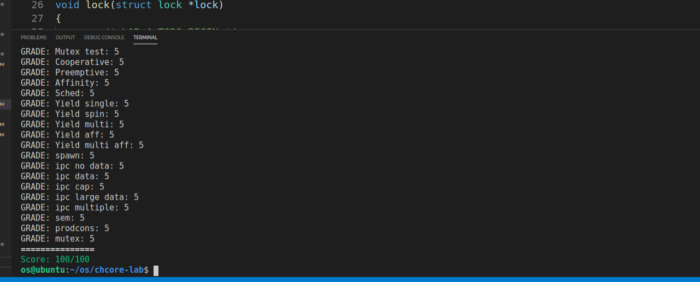

## 实验 4：多核、多进程、调度与IPC

学号：520021910605   姓名：罗世才


#### 思考题 1：阅读汇编代码`kernel/arch/aarch64/boot/raspi3/init/start.S`。说明ChCore是如何选定主CPU，并阻塞其他其他CPU的执行的。

**1.选定主CPU**

```
	mrs	x8, mpidr_el1
	and	x8, x8,	#0xFF
	cbz	x8, primary
```

  首先从`mpidr_el1`中取出CPU的ID放在x8寄存器中，通过`cbz`命令，如果x8为0(0号核即主CPU)则跳转到primary处首先初始化，其它的核则顺序执行通过循环被阻塞。

**2.阻塞其它CPU**

```
wait_for_bss_clear:
	adr	x0, clear_bss_flag
	ldr	x1, [x0]
	cmp     x1, #0
	bne	wait_for_bss_clear

	/* Turn to el1 from other exception levels. */
	bl 	arm64_elX_to_el1

	/* Prepare stack pointer and jump to C. */
	mov	x1, #INIT_STACK_SIZE
	mul	x1, x8, x1
	ldr 	x0, =boot_cpu_stack
	add	x0, x0, x1
	add	x0, x0, #INIT_STACK_SIZE
	mov	sp, x0
```

  其它CPU会通过检查`clear_bss_flag`的值是否为0来判断bss段有没有被清空：若不为0则说明未清空，跳转回`wait_for_bss_clear`处继续循环以阻塞该CPU的执行；若已为0，则将异常级别转为el1并准备栈指针。

```
wait_until_smp_enabled:
	/* CPU ID should be stored in x8 from the first line */
	mov	x1, #8
	mul	x2, x8, x1
	ldr	x1, =secondary_boot_flag
	add	x1, x1, x2
	ldr	x3, [x1]
	cbz	x3, wait_until_smp_enabled

	/* Set CPU id */
	mov	x0, x8
	bl 	secondary_init_c
```

  这段代码是为了保证其它CPU逐个有序的初始化，核心是控制secondary_boot_flag数组的值。具体而言，只有当`secondary_boot_flag[cpuid]!=0`时才可以跳出循环并调用`secondary_init_c`进行初始化，在练习题3实现的`enable_smp_cores`中，主CPU依次将 secondary_boot_flag 数组中对应副CPU的元素设置为 1，这样其他CPU就会跳出循环等待并开始初始化。初始化完成后，副CPU将其状态设置为“running”，并通过 cpu_status 数组来通知主CPU。从而完成先阻塞其它CPU，选定主CPU初始化，随后其它CPU依次初始化这一过程。


#### 思考题 2：阅读汇编代码`kernel/arch/aarch64/boot/raspi3/init/start.S, init_c.c`以及`kernel/arch/aarch64/main.c`，解释用于阻塞其他CPU核心的`secondary_boot_flag`是物理地址还是虚拟地址？是如何传入函数`enable_smp_cores`中，又该如何赋值的（考虑虚拟地址/物理地址）？

​    **secondary_boot_flag是物理地址**。

​    **传参关系：** 

 1. 在`init.c`中，定义了secondary_boot_flag数组，并传入`start_kernel(void *boot_flag)`中;
  2. `start_kernel`是用汇编写的函数，在结束前，该函数调用main(paddr_t boot_flag)将其传入`main`中;
  3. 在`main`中，调用了enable_smp_cores(paddr_t boot_flag)将secondary_boot_flag传`enable_smp_cores`中，完成传参过程。

​    **如何赋值**： 

```
    secondary_boot_flag = (long *)phys_to_virt(boot_flag);
```

​      如上所示，根据物理地址取得其虚拟地址，再对虚拟地址处赋值。


#### 练习题 3：完善主CPU激活各个其他CPU的函数：`enable_smp_cores`和`kernel/arch/aarch64/main.c`中的`secondary_start`

​       一共3个空分别填写代码如下所示：

```
   // enable_smp_cores中的第一空：
   secondary_boot_flag[i] = 1;
   
   // enable_smp_cores中的第二空：
   while (cpu_status[i] == cpu_hang);
   
   // secondary_start中的空：
   cpu_status[cpuid] = cpu_run;
```

​       具体逻辑为：首先将`secondary_boot_flag[i]`设为1让对应的CPU可以进行初始化，然后通过一个`while循环`在ID为i的CPU还没有完成初始化时阻塞主CPU，在ID为i的CPU完成初始化后通过修改其对应的`cpu_status`为`cpu_run`来通知主CPU，主CPU就可以从while循环中出来继续执行。


#### 练习题 4：实现并使用大内核锁

​    **1.请熟悉排号锁的基本算法，并在`kernel/arch/aarch64/sync/ticket.c`中完成`unlock`和`is_locked`的代码。**

​       在unlock中，只需进行`lock_owner++`操作，将锁传递给下一位竞争者。

​       在is_lock中，通过比较`lock->owner`与`lock->next`的大小来判断锁是否处于被持有状态：如果lock->owner小于lock->next说明锁被持有；如果相等则说明锁没有被持有。

​    **2.在`kernel/arch/aarch64/sync/ticket.c`中实现`kernel_lock_init`、`lock_kernel`和`unlock_kernel`。** 

​        `kernel_lock_init`的实现直接调用`lock_init`。

​        `lock_kernel`的实现直接调用`lock`。

​        `unlock_kernel`的实现需要注意，首先判断锁是否被持有，如果被持有则调用`unlock_kernel`，否则直接返回即可。这样做是为了防止lock->owner大于lock->next的错误情况出现。

​    **3.在适当的位置调用`lock_kernel`以及`unlock_kernel`**  

​      Lab4的Guide中提到了5个需要加锁的地方，可以分为3种情况。

​       **情况一**  对应于第1、2点，在创建根进程前以及其它进程开始调度前需要获取大内核锁：

```
  // 在kernel/arch/aarch64/main.c中
  void main(paddr_t bool_flag) {
  ...
      lock_kernel();
 
      create_root_thread();
      kinfo("[ChCore] create initial thread done on %d\n", smp_get_cpu_id());
      eret_to_thread(switch_context());
  ...
  }
  
  // 在kernel/arch/aarch64/main.c中
  void secondary_start(void) {
  ...      
        lock_kernel();
        sched();
        eret_to_thread(switch_context());
  }
```

​          在返回用户态时放锁，对应的函数为`__eret_to_thread`：

```
  /* void eret_to_thread(u64 sp) */
  BEGIN_FUNC(__eret_to_thread)
  	mov	sp, x0
	dmb ish

    bl unlock_kernel
	
	exception_exit
  END_FUNC(__eret_to_thread)
```


​       **情况二**  对应第3点，在跳转到syscall_table中相应的syscall条目前应获取大内核锁，在返回前释放大内核锁：

```
  // 在kernel/arch/aarch64/irq/irq_entry.S中
  el0_syscall:
  
    ...
    
    bl lock_kernel
	
	...
	adr	x27, syscall_table		// syscall table in x27
	uxtw	x16, w8				// syscall number in x16
	ldr	x16, [x27, x16, lsl #3]		// find the syscall entry
	blr	x16

	/* Ret from syscall */
	str	x0, [sp]

    bl unlock_kernel

	exception_exit
```

 

​       **情况三**  对应第4、5点，非内核触发的中断和异常，应该在对应处理函数的第一行获取大内核锁：

```
  // 在kernel/arch/aarch64/irq/irq_entry_c中
  void handle_entry_c(int type, u64 esr, u64 address) {
      if (type >= SYNC_EL0_64) {
          lock_kernel();
      }
   ...
  }
  
  void handle_irq(int type) {
      if (type >= SYNC_EL0_64
          || current_thread->thread_ctx->type == TYPE_IDLE) {
              lock_kernel();
        }
    ...
  }
```

   type表示的是中断或异常的类型，查看`irq_entry.h`可知宏的值0~7都是`_el1`后缀，表示来自内核态，宏的值8~15都是`_el0`后缀，表示来自用户态。

   在返回用户态时放锁，因为这两个handle函数最后都会调用 eret_to_thread，故与情况一相同。


#### 思考题 5：在`el0_syscall`调用`lock_kernel`时，在栈上保存了寄存器的值。这是为了避免调用`lock_kernel`时修改这些寄存器。在`unlock_kernel`时，是否需要将寄存器的值保存到栈中，试分析其原因。

  不需要，因为调用`unlock_kernel`后就直接`exception_exit`了，不需要再使用那些寄存器的值了，因此不需要保存。


#### 思考题 6：为何`idle_threads`不会加入到等待队列中？请分析其原因？

  因为`idle_threads`的作用是在CPU核心没有要调度的线程时运行，防止CPU核心在内核态忙等而导致它持有的大内核锁始终锁住整个内核。其本质并非是想要内核调度运行的线程任务，在有其它线程等待时不应被分配时间片，所以也就不应该加入到等待队列中。


#### 练习题 7：完善`kernel/sched/policy_rr.c`中的调度功能，包括`rr_sched_enqueue`，`rr_sched_dequeue`，`rr_sched_choose_thread`与`rr_sched`，需要填写的代码使用`LAB 4 TODO BEGIN`标出。在完成该部分后应能看到如下输出，并通过`cooperative`测试获得5分。

  下面列出的实现都是加入了调度预算和处理器亲和性的最终实现，如果仅仅实现协作式调度是不需要budget和affinity相关的代码的。

**1.rr_sched_enqueue的实现：** 

​    首先进行必要的检查，idle_thread不加入队列中；然后选取cpu_id；最后修改线程状态并加入对应等待队列中：

```
int rr_sched_enqueue(struct thread *thread) {
  // 检查
  if (thread == NULL || thread->thread_ctx == NULL || thread->thread_ctx->state == TS_READY) {
    return -EINVAL;
  }
  if (thread->thread_ctx->type == TYPE_IDLE) {
    return 0;
  }

  // 选取cpu_id
  u32 cpu_id;
  if (thread->thread_ctx->affinity == NO_AFF) {
    cpu_id = smp_get_cpu_id();
  }
  else {
    cpu_id = thread->thread_ctx->affinity;
  }
  if (cpu_id >= PLAT_CPU_NUM) {
    return -ENAVAIL;
  }      
   
  // 放入相应等待队列中
  list_append(&thread->ready_queue_node, &rr_ready_queue_meta[cpu_id].queue_head);
  rr_ready_queue_meta[cpu_id].queue_len++;
  thread->thread_ctx->state = TS_READY;
  thread->thread_ctx->cpuid = cpu_id;
  return 0;
}
```


**2.rr_sched_dequeue的实现：** 

​    进行必要的检查后，执行移出队列的操作。默认通过检查的thread一定在该等待队列中，判断队列是否为空放到上层实现。

```
int rr_sched_dequeue(struct thread *thread) {
  if (thread == NULL || thread->thread_ctx == NULL || thread->thread_ctx->state != TS_READY) {
    return -ENAVAIL;
  }
  list_del(&(thread->ready_queue_node));
  rr_ready_queue_meta[thread->thread_ctx->cpuid].queue_len--;
  thread->thread_ctx->state = TS_INTER;
  return 0;
}
```


**3.rr_sched_choose_thread的实现：** 

   list_entry宏在之前实现buddy_system时已经用过一次。

   如果等待队列不为空，则选取队列中的第一个线程返回，否则返回idle_thread：

```
struct thread *rr_sched_choose_thread(void) {
  struct thread *thread = NULL;
  u32 cpu_id = smp_get_cpu_id();
  
  if (!list_empty(&rr_ready_queue_meta[cpu_id])) {
     thread = list_entry(rr_ready_queue_meta[cpu_id].queue_head.next, struct thread, ready_queue_node);
     if (rr_sched_dequeue(thread) < 0) {
        thread = &idle_threads[cpu_id];   
     }
   }
   else {
       thread = &idle_threads[cpu_id];
   }
      
  return thread;
}
```


**4.rr_sched的实现：** 

   首先是检查，需要注意的是，如果当前线程的状态不是`TS_RUNNING`则说明该线程不再需要加入等待队列了。如果当前线程的时间片未用完，则继续执行；否则将其加入等待队列中并调用`rr_sched_choose_thread`选择一个线程执行。

```
int rr_sched(void) {
  struct thread *cur = current_thread;
  if (cur != NULL && cur->thread_ctx != NULL && cur->thread_ctx->state == TS_RUNNING) {
      if (cur->thread_ctx->sc->budget != 0) {
         return 0;    
      }
      rr_sched_enqueue(cur);
  }

  cur = rr_sched_choose_thread();
  rr_sched_refill_budget(cur, DEFAULT_BUDGET);
  switch_to_thread(cur);
  
  return 0;
}
```


#### 思考题 8：如果异常是从内核态捕获的，CPU核心不会在`kernel/arch/aarch64/irq/irq_entry.c`的`handle_irq`中获得大内核锁。但是，有一种特殊情况，即如果空闲线程（以内核态运行）中捕获了错误，则CPU核心还应该获取大内核锁。否则，内核可能会被永远阻塞。请思考一下原因。

  因为在`handle_irq`中，其会调用`eret_to_thread`，而`__eret_to_thread`在返回前会`unlock_kernel`。所以，如果空闲线程捕获错误时不获取大内核锁，则锁被lock的次数就少于其被unlock的次数，从而导致一些问题：

1. 如果CPU0上运行空闲线程发生错误时，CPU1此时持有大内核锁正处理一些东西，CPU2在等待大内核锁。则CPU0空闲线程多释放一次锁会使CPU2拿到大内核锁，出现两个线程同时操作内核数据结构的情况，可能导致很多问题；
2. 继续上面的情况分析死锁，假设初始时ticket->owner和ticket->next均为0。则结束时拿了两次锁放了3次锁，ticket->owner=3，ticket->next=2。此时再有一个线程拿锁时，`fetch_and_add`会返回2，但ticket->owner已为3，所以该线程永远也拿不到锁，出现死锁的状况。

在unlock前检查锁是否正被持有，可以避免死锁的出现：

```
void unlock_kernel(void) {
    BUG_ON(!is_locked(&big_kernel_lock));
    if (is_locked(&big_kernel_lock)) {
        unlock(&big_kernel_lock);
    }
}
```

但是无法避免1的问题，所以空闲线程捕获错误时获取大内核锁是十分必要的。


#### 练习题 9：在`kernel/sched/sched.c`中实现系统调用`sys_yield()`，使用户态程序可以启动线程调度。此外，ChCore还添加了一个新的系统调用`sys_get_cpu_id`，其将返回当前线程运行的CPU的核心id。请在`kernel/syscall/syscall.c`文件中实现该函数。

**1.sys_yield的实现：** 

  该实现为加入了调度预算的最终实现，如果仅仅实现协作式调度是不需要budget相关的代码的。

  首先将当前线程的budget设置为0，然后调用sched()使该线程可以被调度走。

```
void sys_yield(void) {
        current_thread->thread_ctx->sc->budget=0;
        sched();
        eret_to_thread(switch_context());
        BUG("Should not return!\n");
}
```

**2.sys_get_cpu_id的实现：** 

  直接将`current_thread->thread_ctx->cpuid`的值返回即可。


#### 练习题 10：定时器中断初始化的相关代码已包含在本实验的初始代码中（`timer_init`）。请在主CPU以及其他CPU的初始化流程中加入对该函数的调用。此时，`yield_spin.bin`应可以正常工作：主线程应能在一定时间后重新获得对CPU核心的控制并正常终止。

  在main.c的`main(paddr_t boot_flag)`和`secondary_start(void)`里加入`timer_init()`的调用即可。


#### 练习题 11：在`kernel/sched/sched.c`处理时钟中断的函数`sched_handle_timer_irq`中添加相应的代码，以便它可以支持预算机制。更新其他调度函数支持预算机制，不要忘记在`kernel/sched/sched.c`的`sys_yield()`中重置“预算”，确保`sys_yield`在被调用后可以立即调度当前线程。完成本练习后应能够`tst_sched_preemptive`测试并获得5分。

**1.sched_handle_timer_irq的实现：** 

   收到中断进入该函数后，如果当前线程的budget不为0，则减1。

```
void sched_handle_timer_irq(void) {
  if(current_thread != NULL && current_thread->thread_ctx != NULL && current_thread->thread_ctx->sc->budget > 0)
     current_thread->thread_ctx->sc->budget--;
}
```

**2.为了支持调度预算其它处的改动：** 

-   `sys_yield`中将budget置0；
- `rr_sched`中切换线程前判断一下当前线程的budget是否为0。

  具体实现已在前面的问题中列出。


#### 练习题 12：在`kernel/object/thread.c`中实现`sys_set_affinity`和`sys_get_affinity`。完善`kernel/sched/policy_rr.c`中的调度功能，增加线程的亲和性支持（如入队时检查亲和度等，请自行考虑）。

**1.sys_set_affinity的实现：**

  理解该函数的上下文后对线程的affinity赋值即可：

```
  thread->thread_ctx->affinity = aff;
```

**2.sys_get_affinity的实现：** 

  理解该函数的上下文后，从线程的属性中查询affinity返回即可：

```
  aff = thread->thread_ctx->affinity;
```


#### 练习题 13：在`userland/servers/procm/launch.c`中填写`launch_process`函数中缺少的代码，完成本练习之后应运行`lab4.bin`应能看到有如下输出：

  文档和代码中的注释非常详细，借着这些提示尝试去理解上下文，进行代码填空。

**1.第一空：**

​    对应于文档基本工作流的第3点，需要调用的函数以及参数size已经给出，第二个参数为`TYPE_USER`，因为现在创建的是用户态进程：

```
main_stack_cap = __chcore_sys_create_pmo(MAIN_THREAD_STACK_SIZE, TYPE_USER);
```

**2.第二空：** 

  对应于文档基本工作流的第4点：

```
  stack_top = MAIN_THREAD_STACK_BASE + MAIN_THREAD_STACK_SIZE;
  offset = MAIN_THREAD_STACK_SIZE - PAGE_SIZE;
```

  `stack_top`很好理解，就是栈的最大虚拟地址。

  `offset`实际上就是一个栈顶地址与栈基地址之间的偏移量，它的作用是帮助我们计算出第一次执行时栈指针应该指向的地址(`MAIN_THREAD_STACK_BASE+offset`也即`stack_top-PAGE_SIZE`)。不好理解是因为我之前接触的栈都是动态分配的，实在没法理解这里为啥突然要指向栈的第一个页的起始地址。后面紧接着有一个`chcore_pmo_write`的调用，一次写一个页，因此可以理解成先将sp-0x1000再push stack。

**3.第三空：** 

  对应文档基本工作流的第5点而且这一空后面的一段代码已经是使用示范了，照着写即可：

```
  pmo_map_requests[0].pmo_cap = main_stack_cap;
  pmo_map_requests[0].addr = ROUND_DOWN(MAIN_THREAD_STACK_BASE, PAGE_SIZE);
  pmo_map_requests[0].perm = VM_READ | VM_WRITE;
  pmo_map_requests[0].free_cap = 1;
```

**4.第四空：** 

```
  args.stack = MAIN_THREAD_STACK_BASE + offset;
```


#### 练习题 14：在`libchcore/src/ipc/ipc.c`与`kernel/ipc/connection.c`中实现了大多数IPC相关的代码，请根据注释完成其余代码。

回顾上课讲的轻量级远程方法调用(LRPC)。

**1.ipc_register_server的实现：** 

  一个用户态进程应该只能注册一个IPC服务，然后每次有client来连的时候再创建服务线程。这里的vm_config是服务进程用作IPC的虚拟地址的总的描述：

```
  vm_config.stack_base_addr = SERVER_STACK_BASE;
  vm_config.stack_size = SERVER_STACK_SIZE;
  vm_config.buf_base_addr = SERVER_BUF_BASE;
  vm_config.buf_size = SERVER_BUF_SIZE;
```

**2.ipc_register_client的实现：** 

  因为一个进程里的各个线程可能都有IPC的需求，所以用作IPC的虚拟地址空间要根据client_id进行划分：

```
  vm_config.buf_base_addr = CLIENT_BUF_BASE + client_id * CLIENT_BUF_SIZE;
  vm_config.buf_size = CLIENT_BUF_SIZE;
```

**3.creat_connection的实现：** 

​    第一、二空需要注意的都是根据conn_idx给出特定的地址，否则多个IPC时会出错。

   第三空就是共享内存的实现，client和server用于IPC的虚拟地址映射到同一块物理地址处。

```
  // 第一空
  server_stack_base = vm_config->stack_base_addr + conn_idx * vm_config->stack_size;
  
  // 第二空
  server_buf_base = vm_config->buf_base_addr + conn_idx * vm_config->buf_size;
  client_buf_base = client_vm_config->buf_base_addr;
  
  // 第三空
  vmspace_map_range(source->vmspace,client_buf_base, buf_size, VMR_READ|VMR_WRITE, buf_pmo);
  vmspace_map_range(target->vmspace,server_buf_base, buf_size, VMR_READ|VMR_WRITE, buf_pmo);
```

**4.sys_ipc_call的实现：** 

  第一空根据注释的提示写即可，第二空我想了很久，主要不明白这个arg在ipc_dispatcher中起着啥作用，最后设置的这个值实际上为`create_connection`中填的`server_buf_base`，应该是起着让用户进程可以正确读取返回值的作用。因为`server_buf_base`和`client_buf_base`被映射到同一块物理内存，且这个`ipc_dispatcher`是在server虚拟地址空间中的，所以这样赋值，server写了返回client同样能读到：

```
  arg = conn->buf.server_user_addr;
```

**5.sys_ipc_return的实现：** 

  一开始我不是特别理解这里的意思，注释中的`the thread`应该指的是server端的服务线程还是client端的用户线程。

  因为我觉得`server_thread`它不会进RR的调度队列，只有在IPC通讯时会被切换执行而且budget算的是用户进程的，所以它的状态，budget其实不需要记录。`client_thread`的budget确实需要更新，状态的话后面调用`thread_migrate_to_client`里面有`switch_to_thread`会设置正确的状态，这里按照注释保险设置一下，最终填写代码如下：

```
  conn->source->thread_ctx->sc->budget = current_thread->thread_ctx->sc->budget;
  conn->source->thread_ctx->state = TS_RUNNING;
```

**6.其它的空都是一些函数调用啥的，没有需要解释的逻辑，严格按照注释填写即可。**


#### 练习题 15：ChCore在`kernel/semaphore/semaphore.h`中定义了内核信号量的结构体，并在`kernel/semaphore/semaphore.c`中提供了创建信号量`init_sem`与信号量对应syscall的处理函数。请补齐`wait_sem`操作与`signal_sem`操作。

**1.wait_sem的实现：** 

​    如果`sem_count`大于0，获取成功；否则当`is_block`为true时，修改当前线程的状态并加入dem的等待队列，使用`obj_put`释放对`sem`的引用，使用`sched`和`eret_to_thread`调度到其它线程：

```
s32 wait_sem(struct semaphore *sem, bool is_block) {
  s32 ret = 0;
  if (sem->sem_count == 0) {
     if (is_block) {
       sem->waiting_threads_count++;
       list_add(&(current_thread->sem_queue_node), &(sem->waiting_threads));
       current_thread->thread_ctx->state = TS_WAITING;
       obj_put(sem);
       sched();
       eret_to_thread(switch_context());
     }
     else {
       ret = -EAGAIN;      
     }
  }
  else {
     sem->sem_count--;
  }
  return ret;
}
```

**2.signal_sem的实现：** 

​    首先判断是否有线程等待，如果有，则唤醒等待队列的第一个线程并将其加入调度队列中；否则`sem_count++` :

```
s32 signal_sem(struct semaphore *sem) {
  if (sem->waiting_threads_count > 0) {
     struct thread * wake_thread = list_entry(sem->waiting_threads.next, struct thread, sem_queue_node);
     list_del(&wake_thread->sem_queue_node);
     sem->waiting_threads_count--;
     sched_enqueue(wake_thread);
   }
   else {
      sem->sem_count++;
   }
   return 0;
}
```


#### 练习题 16：在`userland/apps/lab4/prodcons_impl.c`中实现`producer`和`consumer`。

**1.producer的实现：**  `producer`在写之前`__chcore_sys_wait_sem(empty_slot, true)`，在写之后`__chcore_sys_signal_sem(filled_slot)` 。

**2.consumer的实现：** `consumer`在读之前`__chcore_sys_wait_sem(filled_slot, true)`，在读之后`__chcore_sys_signal_sem(empty_slot)` 。


#### 练习题 17：请使用内核信号量实现阻塞互斥锁，在`userland/apps/lab4/mutex.c`中填上`lock`与`unlock`的代码。注意，这里不能使用提供的`spinlock`。

互斥锁相当于资源量为1的信号量，所以在`lock_init`中将`lock->sem_count`初始化为1,获取锁的操作即`wait_sem`，释放锁的操作即`signal_sem`： 

```
void lock_init(struct lock *lock) {
  lock->lock_sem = __chcore_sys_create_sem();
  __chcore_sys_signal_sem(lock->lock_sem);
}

void lock(struct lock *lock) {
  __chcore_sys_wait_sem(lock->lock_sem, true);
}

void unlock(struct lock *lock) {
  __chcore_sys_signal_sem(lock->lock_sem);
}
```


最后评分：

