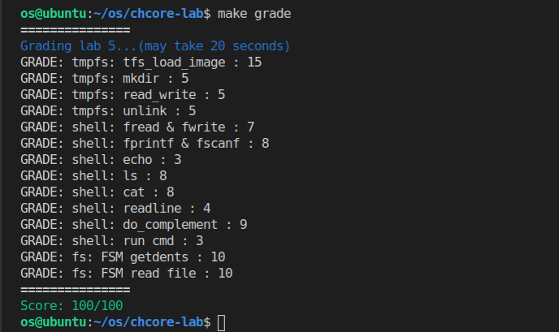

## OS-Lab5：文件系统与SHELL

姓名：罗世才   学号：520021910605


#### 思考题 1: 文件的数据块使用基数树的形式组织有什么好处? 除此之外还有其他的数据块存储方式吗?

  答：ChCore中的基数树相关的数据结构位于`libchcore\include\chcore\fs\radix.h`中，因为之前没接触过基数树，所以在这里记录一下。总的来说，基数树和B+树很像。在Chcore中，一个父节点最多有512个子节点，所以可以用9个bit来区分。因为用来寻找的key是64bit，所以该基数树最多有`RADIX_LEVLES=8`层。在寻找时，首先通过`key&RADIX_NODE_MASK`找到9个bit9个bit的索引，在从基数树的根节点一层层查找到叶子节点。

 **用基数树组织的好处：** 

1. 基数树查找的时间复杂度为O(log n)，查找速度快；
2. 基数树可以动态扩展，不需要预先分配固定大小的空间，因此可以更加灵活高效的管理空间。

  **除了基数树之外，还有很多数据块的组织方式：** 

1. 链表。使用链表可以方便的插入和删除数据块，但是查找性能较差；
2. 数组。使用数组查找性能很高，但是需要预先分配空间，不太灵活；


#### 练习题 2：实现位于`userland/servers/tmpfs/tmpfs.c`的`tfs_mknod`和`tfs_namex`。

**1.tfs_mknod的实现：** 首先通过变量`mkdir`的值判断需要创建的是文件还是目录；然后创建一个新的目录项并将其加入到父目录的哈希表中。

  我不是很清楚这里的参数`len`有什么特别的用处，因为`name`也是参数，再传一个文件名的长度就感觉很奇怪。所以我一开始认为如果是目录，len为目录名的长度；如果是文件，len为文件的大小。但是这样区分在写后面的代码的时候很别扭。最后确定为不论是文件还是目录，len就为名称的长度，`inode->size`应该是写文件时去维护的，和创建文件没关系，自己想多了，具体代码如下：

```
  inode = mkdir ? new_dir() : new_reg();
  dent = new_dent(inode, name, len);
  htable_add(&(dir->dentries), dent->name.hash, &dent->node);
```

**2.tfs_namex的实现：** 使用`while`循环逐个字符的对`name`进行处理，当遇见`/`后截取前面的目录名，首先调用`tfs_lookup`查找对应的`dentry`，若返回为空且`mkdir_p`为true，则使用`tfs_mkdir`创建缺失目录。最终在返回时，`*dirat`指向最后一个`/`前面紧跟着的目录或文件的inode，`**name`为最后一个`/`之后的字符串。

```
  char *tmp;
  int len;
  while (1) {
  	tmp = *name;
	while (*tmp != '/' && *tmp !='\0') {
		tmp++;
	}
	if (*tmp == '\0') {
		break;
	}
	len = tmp - *name;
	memcpy(buff, *name, len);
	buff[len] = '\0';
	dent = tfs_lookup(*dirat, buff, len);
       if (dent == NULL) {
          if (mkdir_p != 0) {
		   tfs_mkdir(*dirat, buff, len);
		   dent = tfs_lookup(*dirat, buff, len);
	   }
	   else {
		   return -ENOENT;
	   }
	}
    *dirat = dent->inode;
	*name = ++tmp;
}
```


#### 练习题 3：实现位于`userland/servers/tmpfs/tmpfs.c`的`tfs_file_read`和`tfs_file_write`。提示：由于数据块的大小为PAGE_SIZE，因此读写可能会牵涉到多个页面。读取不能超过文件大小，而写入可能会增加文件大小（也可能需要创建新的数据块）。

**1.tfs_file_read的实现:** 

- 首先获取`page_no`和`page_off`并调用`radix_get`获得对应的数据页。
- 通过比较一个页未读的大小和剩余待读取的size确定一次读的大小`to_read`。
- 更新`tmp`,`size`,`cur_off`进入下一次循环，直到读取了size大小或到达文件尾。

```
	char * tmp = buff;
    while (size > 0 && cur_off < inode->size) {
		page_no = cur_off / PAGE_SIZE;
		page_off = cur_off % PAGE_SIZE;
        page = radix_get(&inode->data, page_no);
        BUG_ON(!page);
		if (PAGE_SIZE - page_off > size) {
			to_read = size;
		}
		else {
			to_read = PAGE_SIZE - page_off;
		}
        
		memcpy(tmp, page+page_off, to_read);

		tmp += to_read;
		size -= to_read;
		cur_off += to_read;
	}
```


**2.tfs_file_write的实现：** 

- 首先如果写操作导致文件变大，更新文件的size。
- 然后通过一个while循环，首先获取`page_no`和`page_off`，并调用`radix_get`获得对应的数据页。
- 判断当前页是否存在，如果不存在，应该分配新的数据页并调用`radix_add`加入到基数树中。
- 通过比较一个页可写的大小和剩余待写的size确定一次写的大小`to_write`。
- 更新`data`,`size`,`cur_off`进入下一次循环，直到写了size大小。

```
	if (offset+size > inode->size) {
		inode->size = offset + size;
	}
	while (size > 0) {
		page_no = cur_off / PAGE_SIZE;
		page_off = cur_off % PAGE_SIZE;
		page = radix_get(&inode->data, page_no);
        if (page == NULL) {
			page = malloc(PAGE_SIZE);
			radix_add(&inode->data, page_no, page);
		}
		if (PAGE_SIZE-page_off > size) {
			to_write = size;
		}
		else {
			to_write = PAGE_SIZE-page_off;
		}
		memcpy(page+page_off, data, to_write);
		
		data += to_write;
		size -= to_write;
		cur_off += to_write;
	}
```


#### 练习题 4：实现位于`userland/servers/tmpfs/tmpfs.c`的`tfs_load_image`函数。需要通过之前实现的tmpfs函数进行目录和文件的创建，以及数据的读写。

  该函数的参数为CPIO文件的起始地址`start`。首先调用`cpio_init_g_files()`初始化全局变量`g_files`,然后调用`cpio_extract`解析cpio文件，得到链表`g_files`，然后遍历这个链表，根据类型创建对应的目录和文件，并将文件内容写入tmpfs。循环部分的代码如下所示：

```
	for (f = g_files.head.next; f; f = f->next) {
      dirat = tmpfs_root;
	  leaf = f->name;
	  len = f->header.c_filesize;
	  if (!tfs_namex(&dirat, &leaf, 1)) {
	  	dent = tfs_lookup(dirat, leaf, strlen(leaf));
		if (dent==NULL && len!=0) {
            tfs_creat(dirat, leaf, len);
			dent = tfs_lookup(dirat, leaf, strlen(leaf));
			BUG_ON(!dent);
			tfs_file_write(dent->inode, 0, f->data, len);
		}
	  }
	}
```

​    首先获取一些元数据，然后调用`tfs_namex(mkdir_p=1)`保证路径上的目录都存在并且或取最底层的文件名。

​    然后通过`tfs_lookup`查看该文件是否存在，如果该文件不存在且文件名不为空(即不是`"/dir/"`这种情况)，就创建文件写入数据，否则就继续循环处理下一个文件。


#### 练习题 5：利用`userland/servers/tmpfs/tmpfs.c`中已经实现的函数，完成在`userland/servers/tmpfs/tmpfs_ops.c`中的`fs_creat`、`tmpfs_unlink`和`tmpfs_mkdir`函数，从而使`tmpfs_*`函数可以被`fs_server_dispatch`调用以提供系统服务。

总的来说就是`tmpfs_*`的函数调用已有或在前面的练习中实现的`tfs_*`的函数去实现功能。不知道为什么create在tmpfs和tfs之间又加了一层调用。

**1.fs_creat的实现：** 首先使用`tfs_namex(&dirat, &leaf, 1)`处理得到文件名和文件的父目录，并创建路径中缺失的目录。排除掉`"/dir/"`的情况后调用`tfs_creat`创建文件。具体代码如下：

```
    tfs_namex(&dirat, &leaf, 1);
	if (strlen(leaf)==0) {
		return 0;
	}
	else {
		tfs_creat(dirat, leaf, strlen(leaf));
	}
```

**2.tmpfs_unlink的实现：** 首先使用``tfs_namex(&dirat, &leaf, 0)`进行处理得到文件名和文件的父目录，如果报错说明该文件本身不存在直接返回，否则使用`tfs_remove`删除该文件。具体代码如下所示：

```
    err = tfs_namex(&dirat, &leaf, 0);
	if (!err) {
		err = tfs_remove(dirat, leaf, strlen(leaf));
	}
```

**3.tmpfs_mkdir的实现：** 首先使用``tfs_namex(&dirat, &leaf, 1)`。处理得到带创建目录名和父目录，并创建路径中缺失的目录。然后调用`tfs_mkdir`创建目录。具体代码如下所示：

```
    err = tfs_namex(&dirat, &leaf, 1);
	if (!err) {
		err = tfs_mkdir(dirat, leaf, strlen(leaf));
	}
```


#### 练习题 6：补全`libchcore/src/libc/fs.c`与`libchcore/include/libc/FILE.h`文件，以实现`fopen`, `fwrite`, `fread`, `fclose`, `fscanf`, `fprintf`五个函数，函数用法应与libc中一致。

为了实现上面这些函数，减少重复代码，我写了一些工具函数，列举功能如下：

  ipc相关：

- `int my_open_file(const char *filename, FILE *f)` 发送ipc请求打开文件。
- `int my_create_file(const char *filename)` 发送ipc请求创建文件。
- `int my_lseek_file(FILE *f)` 发送ipc请求进行偏移。 

  操作数据：

- `int get_num(char* buf, int* buf_p)` 将`buf`中以`*buf_p`为偏移量的字符串转为数字返回。
- `void get_string(char *buf, int* buf_p, char* bind_data)` 将buf中以`*buf_p`为偏移量的字符串深拷贝给`bind_data`。
- `void int2str(int n, char *str)` 将数字`n`转为字符串存放在`str`中。

有了上面6个工具函数，实现题目中要求的函数如下所示：

**1.FILE结构体的设计：**  

```
typedef struct FILE {
    /* LAB 5 TODO BEGIN */
    int fd;       // 用户程序给该文件分配的fd
    int mode;     // 该文件的打开权限
    unsigned long long offset;    // 文件的偏移量
    /* LAB 5 TODO END */
} FILE;
```

**2.fopen的实现：**  

1. 首先调用`malloc`分配一个新的`FILE`结构体，并初始化。
2. 调用工具函数`my_open_file`尝试打开文件，如果打开成功，直接返回；如果打开失败，则判断`mode`是否有创建的权限。
3. 如果有创建的权限，则调用`my_create_file`创建文件，并调用`my_open_file`打开文件后返回。否则报错。

**3.fwrite的实现：** 

1.  首先检查文件是否有写的权限，如果有则进行下面的步骤，否则报错。

2. 调用`my_lseek_file`使写的起始位置正确。

3. 发送ipc请求进行写操作，然后调整`FILE`结构体中的`offset`，代码如下：

   ```
   struct ipc_msg *ipc_msg = ipc_create_msg(
       fs_ipc_struct, sizeof(struct fs_request) + len, 0);
   chcore_assert(ipc_msg);
   struct fs_request *fr = (struct fs_request *)ipc_get_msg_data(ipc_msg);
   memcpy((void *)fr + sizeof(struct fs_request), src, len);
   fr->req = FS_REQ_WRITE;
   fr->write.count = len;
   fr->write.fd = f->fd;
   ret = ipc_call(fs_ipc_struct, ipc_msg);
   chcore_bug_on(ret != len);
   ipc_destroy_msg(fs_ipc_struct, ipc_msg);
   f->offset += ret; 
   ```

**4.fread的实现：** 

1. 通过`my_lseek_file`使读的起始位置正确。

2. 发送ipc请求进行读操作，然后调整`FILE`结构体中的`offset`，代码如下：

   ```
   struct ipc_msg *ipc_msg = ipc_create_msg(
       fs_ipc_struct, sizeof(struct fs_request) + len + 2, 0);
   chcore_assert(ipc_msg);
   struct fs_request *fr = (struct fs_request *)ipc_get_msg_data(ipc_msg);
   fr->req = FS_REQ_READ;
   fr->read.fd = f->fd;
   fr->read.count = len;
   ret = ipc_call(fs_ipc_struct, ipc_msg);
   memcpy(destv, ipc_get_msg_data(ipc_msg), ret);
   ipc_destroy_msg(fs_ipc_struct, ipc_msg);
   f->offset += ret; 
   ```

**5.fclose的实现：** 

   直接发送ipc请求关闭文件，之后释放`FILE`结构体的空间即可。

**6.fscanf的实现：** 

1. 首先调用`fread`读取文件的所有内容到`buf`中，然后通过一个`while`循环同时遍历`buf`和`fmt`。
2. 判断字符是否为`%`，如果是，执行4；如果不是，执行3。
3. 判断`buf`和`fmt`中该位置的字符是不是相等的，如果是相等的，说明没有问题，`buf`和`fmt`同时向前移动，处理下一个字符；如果不相等，则报错。
4. 判断下一个是`d`还是`s`，如果都不是则报错。
5. 对于`%d`的情况，调用工具函数`get_num`将`buf`中偏移量为`buf_p`的数字字符串转为数字，赋给可变参数列表中的参数；对于`%s`的情况，调用工具函数`get_string`将`buf`中偏移量为`buf_p`的字符串赋给可变参数列表中的参数。 

具体代码如下所示：

```
int fscanf(FILE *f, const char *fmt, ...) {
    va_list va;
    va_start(va, fmt);
    char buf[BUF_SIZE] = {'\0'};
    int fmt_p = 0, buf_p = 0, fmt_size = strlen(fmt);
    int file_size = fread(buf, sizeof(char), BUF_SIZE, f);
    while (buf_p < file_size && fmt_p < fmt_size) {
        if (fmt[fmt_p] == '%') {
            fmt_p++;
            switch (fmt[fmt_p]) {
            case ('d'): {
                int *bind_data = va_arg(va, int *);
                *bind_data = get_num(buf, &buf_p);
                break;
            }
            case ('s'): {
                char *bind_data = va_arg(va, char *);
                get_string(buf, &buf_p, bind_data);
                break;
            }
            default: {
                chcore_bug("unsupported data type");
            }
            }
        fmt_p++;
        } else {
            chcore_assert(buf[buf_p] == fmt[fmt_p]);
            fmt_p++;
            buf_p++;
        }
    }
    va_end(va);
    return 0;
}
```

**7.fprintf的实现：** 

1. 首先分配一个`wbuf`，存储处理后的字符串。
2. 遍历`fmt`，对于非`%`的字符，直接后移。碰到`%`后，首先将上一个`%`到此`%`之间的常规字符拷贝到`wbuf`中，x再判断下一个字符是`d`还是`s`，都不是则报错。
3. 对于`%d`的情况，调用工具函数`int2str`将可变参数参数列表中对应的整型转为字符串类型并拷贝到`wbuf`中；对于`%s`的情况，直接将可变参数列表中的字符参数拷贝到`wbuf`中。

具体代码如下所示：

```
int fprintf(FILE * f, const char * fmt, ...) {
    char wbuf[512];
    memset(wbuf, 0x0, sizeof(wbuf));
    va_list va;
    va_start(va, fmt);
    printf("%s\n", fmt);
    int start = 0, i = 0;
    int offset = 0;
    while(i < strlen(fmt)){
        if(fmt[i] == '%'){
	    memcpy(wbuf + offset, fmt + start, i - start);
	    offset += i - start;
	    i++;
	    start = i + 1;
            switch (fmt[i]) {
                case 'd':{
	            int tmp = va_arg(va, int);
		    char str[256];
		    memset(str, '\0', sizeof(str));
		    int2str(tmp, str);
		    memcpy(wbuf + offset, str, strlen(str));
		    offset += strlen(str);                                
                    break;
                }
                case 's':{
		    char *tmp = va_arg(va, char *);
		    memcpy(wbuf + offset, tmp, strlen(tmp));
		    offset += strlen(tmp);   
                    break;                             
                }
                default:
                    chcore_bug("unsupported data type");
            }
	}
	i++;
    }
    printf("wbuf is %s ||\n", wbuf);
    fwrite(wbuf, sizeof(char), sizeof(wbuf), f);
    va_end(va);
    return 0;
}
```


#### 练习题 7：实现在`userland/servers/shell/main.c`中定义的`getch`，该函数会每次从标准输入中获取字符，并实现在`userland/servers/shell/shell.c`中的`readline`，该函数会将按下回车键之前的输入内容存入内存缓冲区。代码中可以使用在`libchcore/include/libc/stdio.h`中的定义的I/O函数

**1.getch的实现：** 直接调用`c = chcore_console_getc()`从标准输入获取一个字符并返回即可。

**2.readline的实现：** 在`while`循环中，首先判断字符c的类型:

- 如果是`\n`或`\r`则调用`chcore_console_putc('\n')`在shell中换行并且直接返回已读取的字符串`buf`。
- 如果是`\t`，就调用`do_complement`函数进行补全并将补全的字符串在shell中打印出来。
- 如果不是上面的特殊字符，则`complement_time`置0，将该字符填入buf中并且调用`chcore_console_putc`打印出来给用户一个反馈。

   这个是在练习题9加入`\t`后的最终代码，具体代码如下所示：

```
	while (1) {
    	__chcore_sys_yield();
		c = getch();

		if (c != '\t')
			complement_time = 0;
		if(c == '\n' || c == '\r'){
			chcore_console_putc('\n');
			break;
		}
		else if(c == '\t'){
			if (do_complement(buf, complement, complement_time) == 0) {
				complement_time++;
				printf("%s\n", complement);
			};
			continue;			
		}	
    	buf[i] = c;
		i++;
		chcore_console_putc(c);
	}
```


#### 练习题 8：根据在`userland/servers/shell/shell.c`中实现好的`bultin_cmd`函数，完成shell中内置命令对应的`do_*`函数，需要支持的命令包括：`ls [dir]`、`echo [string]`、`cat [filename]`和`top`。

因为文件的打开，关闭和读取操作很频繁，所以将这些操作抽象成函数，方便调用，减少重复的代码。其中`open_file`接受文件的路径和用户指定的fd两个参数，发送IPC到服务端，打开文件，建立fd到fid的映射后返回；`close_file`接受fd，关闭对应的文件；`read_whole_file`读取整个文件，返回实际读取的字节数。3个函数参考`fakefs`和`tmpfs`中的代码进行实现：

```
int open_file(const char *path, int fd) {
    struct ipc_msg *ipc_msg = ipc_create_msg(
        fs_ipc_struct, sizeof(struct fs_request), 0);
    chcore_assert(ipc_msg);
    struct fs_request *fr = (struct fs_request *)ipc_get_msg_data(ipc_msg);
    fr->req = FS_REQ_OPEN;
    strcpy(fr->open.pathname, path);
    fr->open.flags = O_RDONLY;
    fr->open.new_fd = fd;
    int ret = ipc_call(fs_ipc_struct, ipc_msg);
    ipc_destroy_msg(fs_ipc_struct, ipc_msg);
    return ret;
}

int close_file(int fd) {
    struct ipc_msg *ipc_msg = ipc_create_msg(
        fs_ipc_struct, sizeof(struct fs_request), 0);
    chcore_assert(ipc_msg);
    struct fs_request *fr = (struct fs_request *)ipc_get_msg_data(ipc_msg);
    fr->req = FS_REQ_CLOSE;
    fr->close.fd = fd;
    int ret = ipc_call(fs_ipc_struct, ipc_msg);
    ipc_destroy_msg(fs_ipc_struct, ipc_msg);
    return ret;
}

int read_whole_file(int fd, char *buf) {
    int cnt = 256;
    int ret = 0;
    int p = 0;
    do {
        struct ipc_msg *ipc_msg =
            ipc_create_msg(fs_ipc_struct,
                sizeof(struct fs_request) + cnt + 2, 0);
            chcore_assert(ipc_msg);
            struct fs_request *fr =
                (struct fs_request *)ipc_get_msg_data(ipc_msg);
            fr->req = FS_REQ_READ;
            fr->read.fd = fd;
            fr->read.count = cnt;
            ret = ipc_call(fs_ipc_struct, ipc_msg);
            if (ret > 0) {
                memcpy(buf + p, ipc_get_msg_data(ipc_msg), ret);
                    p += ret;
            }
            ipc_destroy_msg(fs_ipc_struct, ipc_msg);
    } while (ret > 0);
        return p;
}
```

  **1.ls [dir]和fs_scan的实现：** 

​     `do_ls`处理一下输入后将带列举的目录路径传入`fs_scan`中。`fs_scan`首先调用工具函数`open_file`打开文件，然后调用`getdents`获取全部的 `dir entry`，最后参照`demo_getdents`的实现，将各个目录项对应的文件名打印出来。需要注意的是应该忽略文件本身，即文件名为'.'则跳过不打印：

```
void fs_scan(char *path) {
    char name[BUFLEN];
	char scan_buf[BUFLEN];
	int offset;
	struct dirent *p;
    int ret;
	int fd = alloc_fd();

	ret = open_file(path, fd);
    
	ret = getdents(fd, scan_buf, BUFLEN);
	for (offset = 0; offset < ret; offset += p->d_reclen) {
			p = (struct dirent *)(scan_buf + offset);
			get_dent_name(p, name);
			if(name[0]!='.')
				printf("%s ", name);
	}
}
```

  **2.echo [string]的实现：** 在函数`do_echo`中，首先跳过"echo"字符串，然后忽略空格，将这样处理过后的`cmdline`打印出来即可：

```
int do_echo(char *cmdline) {
	cmdline += 4;
	while(cmdline && *cmdline == ' '){
		cmdline++;
	}
	printf("%s", cmdline);
	return 0;
}
```

  **3.cat [filename]和print_file_content的实现：** 

  `do_cat`中处理一下`cmdline`得到标准的文件路径并将其传入`print_file_content`中。在`print_file_content`中首先调用`open_file`打开文件，然后调用`read_whole_file`读取文件内容到`buf`中，最后将`buf`打印出来：

```
void print_file_content(char* path)  {
    if (!fs_ipc_struct) {
        connect_tmpfs_server();
    }
	int file_fd = alloc_fd();
	int ret = open_file(path, file_fd);

	char buf[BUFLEN];
    memset(buf, 0, BUFLEN);
	ret = read_whole_file(file_fd, buf);
    printf("%s", buf);
    ret = close_file(file_fd);
}
```


#### 练习题 9：实现在`userland/servers/shell/shell.c`中定义的`run_cmd`，以通过输入文件名来运行可执行文件，同时补全`do_complement`函数并修改`readline`函数，以支持按tab键自动补全根目录（`/`）下的文件名。

**1.修改read_line函数：** 详见上面的练习题7。

**2.do_complement的实现：** 首先调用`open_file`打开根目录文件，再调用`getdents`获取根目录下所有的`dir entry`，然后参考`demo_getdents`的遍历方式去获取每一个目录项对应的文件名。当获取到第`complement_time`个时，返回该文件名。需要注意的是应该忽略文件本身，即文件名为'.'时，不计数并跳过。具体代码如下所示：

```
int do_complement(char *buf, char *complement, int complement_time) {
	int ret = 0, j = 0;
	struct dirent *p;
	char name[BUFLEN];
	char scan_buf[BUFLEN];
	int r = -1;
	int offset;

	int fd = alloc_fd();
    open_file("/", fd);
	
	ret = getdents(fd, scan_buf, BUFLEN);
	for (offset = 0; offset < ret; offset += p->d_reclen, j++) {
		p = (struct dirent *)(scan_buf + offset);
		get_dent_name(p, name);
		if(name[0] == '.'){
				j--;
				continue;
		}
		if(j == complement_time){
			strcpy(complement, name);
			return 0;
		}
	}
	return r;
}
```


#### 练习题 10：本练习需要实现`userland/server/fsm/main.c`中空缺的部分，使得用户程序将文件系统请求发送给FSM后，FSM根据访问路径向对应文件系统发起请求，并将结果返回给用户程序。实现过程中可以使用`userland/server/fsm`目录下已经实现的函数。

  这部分代码的主要功能是完成对IPC的转发操作。

  通过测试用例只需要完成`FS_REQ_OPEN`，`FS_REQ_READ`，`FS_REQ_CLOSE`，`FS_REQ_GETDENTS64`四种情况，考虑到前面的练习中使用的函数，我也实现了`FS_REQ_CREAT`和`FS_REQ_WRITE`。

  写代码之前需要了解老师给的三个函数的作用：

- `fs_set_mount_info_withfd`：将`fd`和`mount_point_info`关联起来并放入一个全局的数据结构中，方便后面通过`fd`查找`mpinfo`。
- `fs_get_monut_info_withfd`：通过`fd`查找`mpinfo`，与`fs_set_mount_info_withfd`搭配使用。
- `strip_path`： 去除文件路径中挂载点的前缀。如`/mount/file`，挂载点路径为`/mount`经此函数处理后为`/file`。

  然后就可以实现了，逻辑大都相似，先获取`mpinfo`然后转发ipc消息。

  **1.FS_REQ_OPEN的实现：** 

- 首先通过完整路径，调用`get_mount_point`获取挂载点信息`mpinfo`。然后调用`strip_path`得到挂载点下的路径。并调用`fsm_set_mount_info_withfd`将`fd`与`mpinfo`关联起来。
- 组装并转发IPC消息。

  具体代码如下所示：

```
case FS_REQ_OPEN:
    mpinfo = get_mount_point(fr->open.pathname, strlen(fr->open.pathname));
	strip_path(mpinfo, fr->open.pathname);
    fsm_set_mount_info_withfd(client_badge, fr->open.new_fd, mpinfo);
    redirect_ipc_msg = ipc_create_msg(mpinfo->_fs_ipc_struct, fs_request_len, 0);
	redirect_fr = (struct fs_request*)ipc_get_msg_data(redirect_ipc_msg);
			
	redirect_fr->req = FS_REQ_OPEN;
	redirect_fr->open.new_fd = fr->open.new_fd;
	redirect_fr->open.fid = fr->open.fid;
	redirect_fr->open.flags = fr->open.flags;
	redirect_fr->open.mode = fr->open.mode;	
	strcpy(redirect_fr->open.pathname, fr->open.pathname);

    ret = ipc_call(mpinfo->_fs_ipc_struct, redirect_ipc_msg);
	ipc_destroy_msg(mpinfo->_fs_ipc_struct, redirect_ipc_msg);
	break;
```

**2.FS_REQ_READ的实现：** 与open类似。不同的是：read的ipc请求中没有文件路径，需要通过`fsm_get_mount_info_withfd`来得到挂载点信息。在发送ipc后，要将读到的数据拷贝到原有的`ipc_msg`中。

**3.其余请求的实现均类似，详见提交代码。**


**运行测试脚本评分：**

