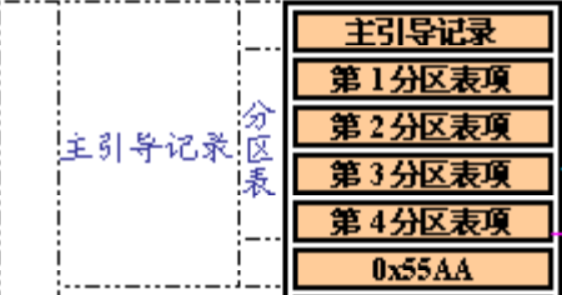

## OS-Lab6：设备驱动与持久化

姓名：罗世才   学号：520021910605


#### 思考题 1：请自行查阅资料，并阅读`userland/servers/sd`中的代码，回答以下问题:

- **circle中还提供了SDHost的代码。SD卡，EMMC和SDHost三者之间的关系是怎么样的？**

答：SD卡和EMMC都是物理设备。SD卡是一种可移动存储介质，EMMC是集成了闪存和控制器功能的SD卡解决方案。它们在外形和尺寸上都相似，且使用相同的物理接口（如SPI或SDIO）与主机系统进行通信。不同的是，EMMC在内部集成了控制器和闪存存储芯片，而SD卡通常将控制器作为外部组件与闪存存储芯片组合在一起，所以EMMC可以看作是SD卡的一种特殊形式，具有更高的集成度和性能。

  SDHost是一个驱动程序或模块，用于在操作系统中提供对SD卡和EMMC设备的访问和控制。它作为操作系统和SD卡/EMMC设备之间的中间层，实现了与SD卡/EMMC设备之间的通信协议，并提供了初始化，读取，写入等操作的功能接口，使操作系统能够通过统一的接口与这些设备进行交互，而无需直接处理物理层的细节。

- **请详细描述Chcore是如何与SD卡进行交互的？即Chcore发出的指令是如何输送到SD卡上，又是如何得到SD卡的响应的。(提示: IO设备常使用MMIO的方式映射到内存空间当中)**

答：ChCore与SD卡交互的代码在sd_server.c中，该文件中一些函数的功能如下：

1. `map_mmio函数`：将SD卡控制器的物理内存映射到ChCore的虚拟地址空间。这样，Chcore就可以通过读写映射后的内存地址来访问SD卡控制器的内存区域。
2. `sd_dispatch函数`：SD卡服务程序的主要处理函数，它根据接收到的IPC消息中请求类型调用相应的读取（`sdcard_readblock`）或写入（`sdcard_writeblock`）函数，并将返回结果发送回客户端。它是通过IPC与其它进程进行通信的接口。

  所以，Chcore与SD卡交互的过程如下：

1. `sd_server`初始化：
   - SD卡服务程序首先调用`map_mmio`将SD卡控制器的物理内存映射到ChCore的虚拟地址空间。
   - 调用`Initialize()`初始化驱动。
   - 通过`ipc_register_server`函数注册SD卡服务程序，使其能接收来自客户端进程的IPC请求.
   - 进入一个无限循环，调用`__chcore_sys_yield`函数，等待IPC请求到来。
2. 当Chcore需要读取或写入SD卡时，会通过IPC向`sd_server`发送一个包含读取或写入命令、逻辑块地址(lba)和数据缓冲区地址的请求消息。
3. `sd_server`接受到IPC请求消息后，会通过`sd_dispatch`函数，根据请求类型，调用`sdcard_readblock`或`sdcard_writeblock`函数执行对SD卡的读取或写入操作。并将结果作为IPC的返回值发送回ChCore。


- **请简要介绍一下SD卡驱动的初始化流程。**

答：SD卡驱动的初始化流程如下所示：

1. `sd_server.c`中的main函数调用`emmc.c`中的`Initialize()`函数进行实际的SD卡驱动初始化操作。
2. `Initialize()`函数首先为`m_pSCR`分配一块内存空间，用于存储SD卡的配置信息，然后调用`CardInit()`函数进行SD的初始化。
3. `CardInit()`首先调用`PowerOn()`打开SD卡电源，然后读取EMMC控制器的版本号，并将其存储在变量`m_hci_ver`中，最后调用`CardReset()`函数进行SD卡复位操作。在Raspberry Pi 4上，`SEND_SCR`命令可能会出现数据超时错误，因此在失败时进行多次重试。
4. `CardReset()`函数非常长而且难以理解，它应该是真正进行SD卡重置和初始化的函数。它会根据`USE_SDHOST`是否被定义，树莓派版本号（`RASPPI`的值）等来条件编译不同的代码。所做的操作包括设置一些寄存器如`EMMC_CONTROL1`，设置控制器时钟频率，初始化设备结构以及很多通过调用`IssueCommand()`函数直接发送命令给SD卡的代码。总的来说，如果该函数返回值不为-2说明重置和初始化成功，否则失败。


- **在驱动代码的初始化当中，设置时钟频率的意义是什么？为什么需要调用`TimeoutWait`进行等待?**

答：在驱动代码的初始化中，设置时钟频率的目的是为了确保SD卡与主控制器之间的通信时钟在可接受的范围内工作。因为SD卡与主控制器之间的通信需要一个时钟信号来同步数据传输，时钟频率决定了数据传输的速度，过高或过低的时钟频率都可能导致通信错误或数据丢失。因此，在初始化阶段，需要将时钟频率设置为一个合适的值，以确保可靠的通信。

  `TimeoutWait(unsigned long reg, unsigned mask, int value, unsigned usec)`函数是一个超时等待函数，其功能是等待特定的寄存器位在指定的时间内达到期望的值，如果达到了则返回0，否则返回-1。我认为在写寄存器时调用该函数的原因为：确保前面的写操作完成或达到期望的状态。写设备寄存器可能需要一定的时间，如果在确保写操作完成之前就执行后续的操作，可能引发一些错误，如对尚未完成的寄存器操作进行读取或使用等。


#### 练习 1：完成`userland/servers/sd`中的代码，实现SD卡驱动。驱动程序需实现为用户态系统服务，应用程序与驱动通过 IPC 通信。需要实现 `sdcard_readblock` 与 `sdcard_writeblock` 接口，通过 Logical Block Address(LBA) 作为参数访问 SD 卡的块。

  **1.sdcard_readblock的实现：** 

- 在`sd_server.c`的`sdcard_readblock`是最外层的接口函数。首先会通过参数Logical Block Address(LBA)计算出实际的偏移量并调用`Seek()`函数移到该偏移处，然后调用`sd_Read`进行实际的读取。具体代码如下所示：

  ```
  static int sdcard_readblock(int lba, char *buffer) {
  	u64 offset = (u64)lba * BLOCK_SIZE;
      Seek(offset);
  	int ret = sd_Read(buffer, BLOCK_SIZE);
  	return ret;
  }
  ```

- 在`emmc.c`的`sd_Read()`函数首先会判断`m_ulloffset`是否是`SD_BLOCK_SIZE`的整数倍（因为sd卡是以块为单位读写），在合法的情况下计算出块号，并调用`DoRead()`函数。具体代码如下所示：

  ```
  int sd_Read(void *pBuffer, size_t nCount) {
      if (m_ullOffset % SD_BLOCK_SIZE != 0) {
  		return -1;
  	}
  	u32 nBlock = m_ullOffset / SD_BLOCK_SIZE;
  
  	if (DoRead((u8 *)pBuffer, nCount, nBlock)!= (int)nCount) {
  		return -1;
  	}
  	return 0;
  }
  ```

- 在`emmc.c`的`DoRead()`函数首先会调用`EnsureDataMode()`保证sd卡的状态正确，然后调用`DoDataCommand(is_write=0)`去实际发送命令给sd卡。具体代码如下所示：

  ```
  int DoRead(u8 * buf, size_t buf_size, u32 block_no) {
      if (EnsureDataMode() != 0) {
  		return -1;
  	}
  
  	if (DoDataCommand(0, buf, buf_size, block_no) < 0) {
  		return -1;
  	}
  	return buf_size;
  }
  ```

- 在`emmc.c`的`DoDataCommand()`中，会根据参数`is_write`的值发送对应得命令给sd卡。具体代码如下所示：

  ```
      if (is_write) {
  		if (m_blocks_to_transfer > 1) {
  			command = WRITE_MULTIPLE_BLOCK;
  		}
  		else {
  			command = WRITE_BLOCK;
  		}
  	}
  	else {
  		if (m_blocks_to_transfer > 1) {
  			command = READ_MULTIPLE_BLOCK;
  		}
  		else {
  			command = READ_SINGLE_BLOCK;
  		}
  	}
  ```

**2.sdcard_writeblock的实现：** 

- 在`sd_server.c`的`sdcard_writeblock`是最外层的接口函数。首先会通过参数Logical Block Address(LBA)计算出实际的偏移量并调用`Seek()`函数移到该偏移处，然后调用`sd_Write`进行实际的写。
- 在`emmc.c`的`sd_Read()`函数首先会判断`m_ulloffset`是否是`SD_BLOCK_SIZE`的整数倍（因为sd卡是以块为单位读写），在合法的情况下计算出块号，并调用`DoWrite()`函数。
- 在`emmc.c`的`DoWrite()`函数首先会调用`EnsureDataMode()`保证sd卡的状态正确，然后调用`DoDataCommand(is_write=1)`去实际发送命令给sd卡。

- 在`emmc.c`的`DoDataCommand()`中，会根据参数`is_write`的值发送对应得命令给sd卡。

具体代码与read类似，详见gitlab。


#### 练习 2：实现naive_fs。

#### 你需要在 userland/apps/lab6/naive_fs/file_ops.[ch] 中按下述规范实现接口：naive_fs_access，naive_fs_creat，naive_fs_unlink，naive_fs_pread，naive_fs_pwrite。

 文件系统的设计：因为`naive_fs`仅拥有一层目录结构，所有的文件只需保存在根目录下，所以文件系统设计为：

- 第0个Block为`SUPER_BLOCK`，记录文件名到`inode`的映射。
- 第1个Block起为`inode`，数据直接保存在inode中。

  格式为：filename-inodeNum;filename-inodeNum,inodeNum;……   即，文件与文件之间用分号（";"）划分，文件名与inodeNum（实际为数据块）之间用短横线（"-"）划分，同一个文件的多个数据块之间用（","）划分。

  **1.naive_fs_access的实现：** 读取`SUPER_BLOCK`中的数据，将参数`name`与";"和"-"之间的文件名比对，如果匹配上了，说明文件存在，返回0；否则返回1。具体代码如下所示：

```
int naive_fs_access(const char *name) {
    char buffer[BLOCK_SIZE];
    sd_bread(SUPER_BLOCK, buffer);
    int buffer_size = strlen(buffer);
    // 匹配文件名
    int fileName_base = 0;
    int inode_base = 0;
    int find = 0;
    for (int i=0; i<buffer_size; ++i) {
        // 找到一个filename-inode映射，看看文件名是否是要找的那个
        if (buffer[i]=='-') {
            int j=fileName_base;
            for (; j<i; ++j) {
                if (buffer[j] != name[j-fileName_base]) {
                    break;
                }
            }
            // 如果是要找的文件，获取inodeNum后返回
            if (j == i) {
                find = 1;
            }
            // 维护inode_base的起始地址
            inode_base = i+1;
        }
        if (find == 1) {
            return 0;
        }
        // 找到一个filename-inode映射，看看是否需要获取inodeNum
        if (buffer[i]==';') {
            // 维护fileName_base的起始地址
            fileName_base = i+1;
        }
    }
    return -1;
}
```

**2.naive_fs_creat的实现：**首先调用`naive_fs_access()`判断该文件是否已经存在。如果不存在的话读取`SUPER_BLOCK`中的数据，获取最后添加的文件的`inodeNum`并加1即为该文件的`inodeNum`。具体代码如下所示：

```
int naive_fs_creat(const char *name) {
    // 判断文件是否存在
    if (naive_fs_access(name) == 0) {
        printf("[naive_fs_creat]file %s already exist", name);
        return -1;
    }
    // 创建文件
    char buffer[BLOCK_SIZE];
    sd_bread(SUPER_BLOCK, buffer);
    int buffer_size = strlen(buffer);
    //printf("[naive_fs_creat]read buffer size: %d and buffer: %s\n", buffer_size, buffer);
    // 在目录末尾添加
    // 首先找到上一个文件的inode
    char inodeNumStr[128];
    int next_inodeNum = 1; 
    for (int i=buffer_size-1; i>0; --i) {
        if (buffer[i]=='-') {
            int len = buffer_size - i - 2;
            strncpy(inodeNumStr, buffer+i+1, len);
            next_inodeNum = str_to_int(inodeNumStr, len) + 1;
            break;
        }
    }
    //printf("[naive_fs_creat]next inode num:%s to %d\n",inodeNumStr, next_inodeNum);
    // 将创建的文件加入Buffer中
    char Next_InodeNum_str[128];
    int_to_str(next_inodeNum, Next_InodeNum_str);
    //printf("[naive_fs_creat]int_to_str inodeNum: %s\n", Next_InodeNum_str);
    int tmp = buffer_size;
    for (int i=0; i<strlen(name); ++i) {
        buffer[tmp] = name[i];
        tmp++;
    }
    buffer[tmp] = '-';
    tmp++;
    for (int i=0; i<strlen(Next_InodeNum_str); ++i) {
        buffer[tmp] =  Next_InodeNum_str[i];
        tmp++;
    }
    buffer[tmp] = ';';
    tmp++;
    
    //printf("[naive_fs_creat]buffer size change, before %d, after %d\n",buffer_size, strlen(buffer));
    // 写回
    sd_bwrite(SUPER_BLOCK, buffer);
    return 0;
}
```

**3.naive_fs_unlink的实现：** 读取`SUPER_BLOCK`中的数据，查找对应的文件名，如果文件不存在返回-1。否则将其从`buffer`中删除后写回。具体代码如下所示：

```
int naive_fs_unlink(const char *name) {
    char buffer[BLOCK_SIZE];
    sd_bread(SUPER_BLOCK, buffer);
    // 找到要删除的文件，删除后写回即可
    int buffer_size = strlen(buffer);
    // 匹配文件名,目录格式:filename-inodeNum;filename-inodeNum;……
    int fileName_base = 0;
    int fileName_begin = 0;
    int inode_base = 0;
    int find = 0;
    for (int i=0; i<buffer_size; ++i) {
        // 找到一个filename-inode映射，看看文件名是否是要找的那个
        if (buffer[i]=='-') {
            int j=fileName_base;
            for (; j<i; ++j) {
                if (buffer[j] != name[j-fileName_base]) {
                    break;
                }
            }
            // 如果是要找的文件，获取inodeNum后返回
            if (j == i) {
                fileName_begin = fileName_base;
                find = 1;
            }
            // 维护inode_base的起始地址
            inode_base = i+1;
        }
        // 找到一个filename-inode映射，看看是否需要获取inodeNum
        if (buffer[i]==';') {
            if (find==1) {
                char new_buffer[BLOCK_SIZE];
                strncpy(new_buffer, buffer, fileName_begin);
                strcpy(new_buffer+fileName_begin, buffer+i+1);
                sd_bwrite(SUPER_BLOCK, new_buffer);
            }
            // 维护fileName_base的起始地址
            fileName_base = i+1;
        }
    }    
    return 0;
}
```

**4.naive_fs_pread的实现：** 写了一个工具函数`get_inode_by_filename`，输入是文件名，返回对应的数据块号。调用该函数获取数据块号后直接进行读取即可。具体代码如下所示：

```
int naive_fs_pread(const char *name, int offset, int size, char *buffer ) {
    // 判断offset是否合法
    if (offset > BLOCK_SIZE) {
        return 0;
    }
    //printf("[naive_fs_pread] get inode by filename\n");
    int inodeNum = get_inode_by_filename(name);
    char read_buffer[BLOCK_SIZE];
    sd_bread(inodeNum, read_buffer);
    // 不能用strncpy因为它碰见'\0'就截止了
    // strncpy(buffer, read_buffer+offset, size);
    for (int i=0; i<size; ++i) {
        buffer[i] = read_buffer[offset+i];
    }
    /* BLANK END */
    /* LAB 6 TODO END */
    return size;
}
```

**5.naive_fs_pwrite的实现：** 同样调用工具函数`get_inode_by_filename`获取数据块号后直接进行写入即可。具体代码如下所示：

```
int naive_fs_pwrite(const char *name, int offset, int size, const char *buffer) {
    // 判断offset是否合法
    if (offset > BLOCK_SIZE || size%BLOCK_SIZE != 0) {
        return 0;
    }
    //printf("[naive_fs_pwrite] get inode by filename\n");
    int inodeNum = get_inode_by_filename(name);
    sd_bwrite(inodeNum, buffer);
    return size;
}
```

  文件系统总结与反思：我的设计可以满足简单的文件读写需求，优点是文件系统元数据少，组织文件系统所需的存储空间少；抽象层数少因此普通读写性能好。但是也存在很大的问题：例如数据块号单调递增，对数据块的组织不够等等。针对不同的应用场景可能需要进行改进。

#### 思考题：查阅资料了解 SD 卡是如何进行分区，又是如何识别分区对应的文件系统的？尝试设计方案为 ChCore 提供多分区的 SD 卡驱动支持，设计其解析与挂载流程。本题的设计部分请在实验报告中详细描述，如果有代码实现，可以编写对应的测试程序放入仓库中提交。

答：查阅相关资料我了解到，要让SD卡支持分区并且每个分区都可能为不同的文件系统主要通过加一层抽象来实现。而且因为SD卡属于特殊的磁盘，所以在分区和支持多文件系统上有很多都是和磁盘组织相似的。

  **SD卡分区：** 通过分区表来组织有关分区的信息。常见的分区表格式有主引导记录区(MBR)和全局唯一标识分区表（GUID Partition Table，即GPT）。

- MBR（Main Boot Record 主引导记录区）放置在硬盘物理地址0的地方，是SD卡的第一个扇区里面的数据。总共512字节的主引导扇区中，MBR只占用了其中的446个字节，另外64个字节交给了 DPT（Disk Partition Table硬盘分区表），最后两个字节“55，AA”是分区的结束标志。DPT由4个分区表组成，每个16字节。结构如下图所示：

  

- GPT意为GUID分区表。（GUID意为全局唯一标识符）。这是一个正逐渐取代MBR的新标准。之所以叫作“GUID分区表”是因为你的驱动器上的每个分区都有一个全局唯一的标识符(globally unique identifier，GUID)——这是一个随机生成的字符串，可以保证为每一个GPT分区都分配完全唯一的标识符。容量上也没有限制，而mbr最多支持2T。还支持几乎无限个分区数量，GPT硬盘上没有主分区、扩展分区的概念，所有的分区都是叫分区，而由上面的图可知，mbr最多支持四个主分区。
  

  **文件系统识别：** SD卡的每个分区可以对应不同的文件系统，例如FAT32，EXT4等。该分区的文件系统元数据通常存储在分区的开始处，如引导扇区(Boot Sector)或超级块(Superblock)等。通过读取分区的引导扇区或超级块，操作系统或文件系统驱动程序可以确定该分区所使用的文件系统类型。


**设计方案为 ChCore 提供多分区的 SD 卡驱动支持并设计其解析与挂载流程：** 

为 ChCore 提供多分区的 SD 卡驱动支持需要考虑以下几个方面：

1. 设备驱动层设计：需要编写 SD 卡设备驱动程序，与 SD 卡进行通信和操作。这包括底层的读取、写入、块擦除等操作。此功能现已在`emmc.*`中实现，应该不需要怎么改动。

2. 分区表解析：

   - 在驱动程序中，需要解析 MBR（主引导记录区）以获取分区表的信息。MBR 存储在 SD 卡的第一个BLOCK，包含分区表的数据。
   - 分区表的解析可以根据 MBR 的结构，逐个读取分区表项，获取分区的起始扇区和大小等信息。

3. 文件系统挂载：

   - 在分区表解析后，需要根据分区的文件系统类型和起始扇区，挂载对应的文件系统。
   - 挂载过程可以调用相应文件系统的挂载函数，将文件系统与分区关联起来，建立文件系统的数据结构，例如超级块等。
   - 挂载后的文件系统应该提供一组统一的接口函数，供上层使用。

     参考之前虚拟文件系统的实现，它挂载两个文件系统，将tmpfs挂载到路径`/`和将fakefs挂载到路径`/fakefs`。虽然这两个文件系统都是内存文件系统，但是只要提供相同的接口，读取内存，读取sd卡，读取sd卡的不同分区感觉没有什么区别。

   ​    所以`sd_server`这一层我的想法是应该一个分区有一个server。如果以MBR最多四个主分区为例子的话，在`userland/apps/servers`下应该有`sd_partion1_server`等4个server，然后再Chcore启动的时候，分别挂载到`/sd/partion1`，`/sd/partion2`等目录下，像Lab5中的`fakefs`一样对上暴露统一的接口。当读写请求来时，由`fsm`进行请求的转发。

   ​    同时，在每个`sd_partionX_server`内，应该设计自己的文件系统，就像`tmpfs_server`内负责设计和维护`tmpfs`文件系统的元数据和暴露读写接口一样，在`sd_partionX_server`内，维护sd卡每个分区特定的文件系统的元数据（这里可能就是提供一些接口函数，调用这些接口函数可以读写每个分区的超级块，根据用户具体请求和识别出的文件系统类型去读写数据块），和`tmpfs`不同的是，每次读写会调用`emmc`读写sd卡的对应分区而不是读写内存，元数据直接持久化到sd卡对应分区超级块中而不是修改内存中的元数据（不考虑优化的简单实现）。

​           这样设计应该可以提供多分区的SD卡驱动，并且整合到之前Lab5实现的虚拟文件系统中。


#### 测试结果：


